# Atomicity, Memory Ordering, and the x86 Trap
<time datetime="2026-06-12">Jun 12, 2026</time>

## Contents
- [Intro](#intro)
- [RMW and MESI](#rmw-and-mesi)
    - [Read-modify-write in one operation??](#read-modify-write-in-one-operation)
    - [MESI](#mesi)
    - [Did MESI fail us?](#did-mesi-fail-us)
- [The LOCK Prefix](#the-lock-prefix)
    - [What LOCK does](#what-lock-does)
    - [One-word fix](#one-word-fix)
    - [Defining the atomic op](#defining-the-atomic-op)
    - ["Lock-free"](#lock-free)
- [std::atomic](#std-atomic)
    - [A quick init gotcha](#a-quick-init-gotcha)
- [Benchmarks](#benchmarks)
- [Memory Ordering](#memory-ordering)
    - [memory_order, the portable knob](#memory-order-the-portable-knob)
    - [The SB litmus test](#the-sb-litmus-test)
    - [Fixing it with a fence](#fixing-it-with-a-fence)
    - [The std::atomic equivalent of mfence](#the-std-atomic-equivalent-of-mfence)
    - [Release and acquire](#release-and-acquire)
    - [Breaking it on ARM](#breaking-it-on-arm)
- [The Ordering Ladder](#the-ordering-ladder)
    - [Relaxed](#relaxed)
    - [Acquire/Release](#acquire-release)
    - [Sequential](#sequential)
- [Conclusion](#conclusion)
- [References](#references)

## Intro

A low-level C++ role at a finance company got back to me with a take-home OA. I
looked the company up, realized it was HFT, and went down a rabbit hole instead
of taking the OA...

I passed out that night watching Fedor Pikus's *C++ atomics, from
basic to advanced* [[1](#references)], got partway into the memory-ordering
section, and woke up wanting to write this exact post.

Going in, I'd seen atomics in multithreaded code and assumed they were
"indivisible reads and writes" because of some magic instruction. I never knew
why. My prior usage was a thread-task counter and a "should the loop keep
running" flag. Both global, both barely thought through and probably shit code.
Everything else multithreading-wise I've just been using mutexes.

This blog is not going to be a regurgitation of docs. I'm building atomics from
the hardware up, x86-64 specifically, until we hit `std::atomic` and
`std::memory_order` and can read exactly what they compile to. The thesis up
front:

> Atomic operations give you two separate things: atomicity and ordering.
> x86 does most of the ordering for free, which is exactly why it's a trap.

Everything below runs on my machine, an Intel i7-9700K (8 cores, no SMT), gcc
15.2.0.

## RMW and MESI

### Read-modify-write in one operation??

Cppreference [[2](#references)] promises that if one thread writes an atomic
object while another reads it, the behavior is well-defined. No UB, no torn
values. There are three kinds of atomic operations:

1. **store**, a write
2. **load**, a read
3. **read-modify-write (RMW)**, read *and* write, as one operation

That third one stopped me. How does the CPU read a value, modify it, and write
it back as *one* indivisible step? Wikipedia [[3](#references)] describes RMW
(test-and-set, fetch-and-add, compare-and-swap) as one shotting a read and write
in a single atomic operation. Cool. What does that mean physically?

The most useful thing I found was a Stack Overflow answer [[4](#references)]
quoting Linus Torvalds:

> Atomic instructions bypass the store buffer or at least they act as if they do
> - they likely actually use the store buffer, but they flush it and the
> instruction pipeline before the load and wait for it to drain after, and have
> a lock on the cacheline that they take as part of the load, and release as part
> of the store - all to make sure that the cacheline doesn't go away in between
> and that nobody else can see the store buffer contents while this is going on.

That "lock on the cache line" is the thread to pull. I thought atomics were
*lock-free*, so what lock? This reads like the CPU prevents other cores from
touching the same cache line for the length of the operation. Let's look at how
caches stay consistent.

### MESI

The key idea is **coherence**, specifically cache coherence on a multiprocessor.
Two cores must never see different values for the same shared line. The classic
protocol is **MESI**, where every cache line on every core sits in one of four
states:

**M (modified)**  
This core has the only copy and it's dirty (differs from RAM). Must be written
back before anyone else reads it.  
**E (exclusive)**  
Only this core has it, and it's clean (matches RAM).  
**S (shared)**  
Multiple cores have it, all clean.  
**I (invalid)**  
Stale. Another core modified it, this copy can't be used.

It's a state machine driven by two things: the core's own r/w requests, and
"snooped" requests coming across the interconnect from other cores. Roughly,
reading a line you don't have moves you `I -> E/S`, wanting to write moves you
`-> M` and invalidates everyone else, getting snooped by another core's write
knocks you `-> I` [[5](#references)]. The real machine has more edges.

The one-liner that matters: **before a core can write a line, every other core
has to invalidate its copy.**

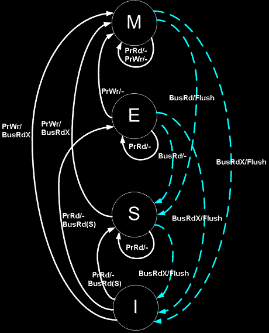

> **Side note: your x86 machine probably isn't running plain MESI.** Intel CPUs
> (including this 9700K) use **MESIF**, which adds a **Forward (F)** state. F
> designates one cache as the responder for read requests so you don't get
> redundant responses from every sharer. AMD uses **MOESI**, which adds an
> **Owned (O)** state. O is dirty-but-shareable, the owner serves reads from
> cache to other cores without writing back to RAM, so RAM is allowed to be
> stale. Same shape, different optimizations. People say "MESI" the way they say
> "kleenex."

### Did MESI fail us?

If coherence makes a single core's RMW look atomic, surely two threads both
doing `x++` are fine, right? MESI's got us? Let's test. Two threads, each
incrementing a shared `int` a million times, print at the end. Should be
2,000,000.

```cpp
#include <print>
#include <thread>

int x = 0;

void worker(void) {
  for (int i = 0; i < 1000000; i++)
    x++;
}

int main(void) {
  std::thread t1(worker), t2(worker);
  t1.join();
  t2.join();
  std::print("{}\n", x);
  return 0;
}
```

```text
$ g++ -O0 --std=c++23 mesi_naive.cpp
$ ./a.out
1047020
$ ./a.out
1006689
$ ./a.out
1046267
```

We all knew this would fail.. but why? Did MESI fail us?

**MESI guarantees coherence, not atomicity of a read-modify-write.**
Coherence means you never read a *stale* line, it says nothing about preventing
two cores from interleaving an RMW on the same value. `x++` is really *load,
add, store*, three steps even when it's a single `inc [mem]` instruction (the
microarchitecture does a read phase then a write phase, it's not indivisible).
The race MESI can't stop:

```text
core 1: load x=0 -> reg=0
core 2: load x=0 -> reg=0     # both S
core 1: reg+1=1, store x=1    # goes M, sends invalidate
core 2: ACKs invalidate on x  # goes I, but reg still = 0
core 2: store reg+1=1 -> x=1  # writes 1 from stale reg!
```

The invalidation hits the cache line, not the register.
Core 2 already pulled `0` into a register and the ALU already computed `1` on
that old value. When the invalidate lands, core 2's *line* goes Invalid. When
core 2 then goes to store, it does pull the latest line (now `1`) back into M
before writing, but **nothing reaches back and fixes the stale `0` sitting in its
register**. It overwrites the fresh `1` with `1` from its own ALU.


The write wasn't lost because coherence broke. Coherence did its job. It was
lost because MESI **has no jurisdiction over a value that's already been pulled
into a register.** What we need is to stop core 2 from even *loading* until core
1's whole RMW is done.

## The LOCK Prefix

Before we can read the manual's line on `LOCK`, two things from that Linus quote
need actual definitions: the **store buffer** and the **pipeline**.

The store buffer is the thing to understand. Writes land there before they hit
coherent cache, same idea as buffering a string before flushing it to a socket.
Writing to memory is slow even when "memory" is L1, so the core buffers stores
and drains them later on one of a handful of trigger events (we'll get the
list in a sec).

> The CPU doesn't run
> one instruction at a time, it overlaps stages (fetch, decode, execute,
> writeback) the way a laundromat overlaps washing one load while drying the
> previous one. "Stalling the pipeline" means inserting a bubble where nothing
> advances until some condition holds. That's what fences and locked ops force
> on stores. An instruction *retires* when it exits the pipe for good and its
> result becomes permanent.

### What LOCK does

The AMD64 manual (vol 2 rev 3.07) tells us that before completing a
`LOCK`-prefixed instruction (1) all previous reads and writes must be to
memory and (2) the locked instruction must complete before later writes
[[8](#references)].

> Locked writes are never buffered although locked reads and writes are
> cacheable.

> The manual also lists events that force the processor to drain its write
> buffer: `sfence`, serializing instructions, I/O instructions, locked
> instructions, interrupts and exceptions, and uncacheable reads.

Quick definition since the manual is loose with the word. "Memory" here doesn't
mean DRAM, it means **globally visible**, committed far enough into the coherent
cache hierarchy that every core can see it. The slow part isn't reaching RAM,
it's stalling the pipeline to drain the store buffer.

Here's the part I had to get straight. We need one core to own that cache line
through the **entire** RMW so no other core can sneak a valid load into the
middle. That's exactly what the `LOCK` prefix does [[6](#references)]. It
piggybacks on MESI: the core takes the line into M, and refuses to give it up
until the locked instruction retires. Another core can't RFO it
(request-for-ownership, the invalidate-everyone-so-I-can-write message from the
MESI section) mid-flight, so the read-then-write window is sealed.

> While I'm here, `XADD` looked promising. It exchanges dest and src, then
> writes their sum into dest [[7](#references)]. One instruction, so it's
> atomic, right? Nope. One *instruction* isn't one *atomic operation*. `xadd`
> still has a read phase and a write phase another core can interleave between.
> You need the `LOCK` prefix on it. We'll see this.

### One-word fix

Let's stretch `x++` into inline asm as a baseline:

```diff
 void worker(void) {
   for (int i = 0; i < 1000000; i++)
-    x++;
+    asm("inc %0" : "+m"(x));
 }
```

```text
$ g++ -O1 --std=c++23 no_lock.cpp
$ ./a.out
1027212
```

This is, of course, still wrong. Now let's add the `LOCK` prefix:

```diff
 void worker(void) {
   for (int i = 0; i < 1000000; i++)
-    asm("inc %0" : "+m"(x));
+    asm("lock inc %0" : "+m"(x));
 }
```

```text
$ g++ -O1 --std=c++23 lock.cpp
$ ./a.out
2000000
```

Magic ヽ(°〇°)ﾉ! The disassembly of `worker()` is literally a "one word
difference" (`-g -O1` for a clean 1:1 loop):

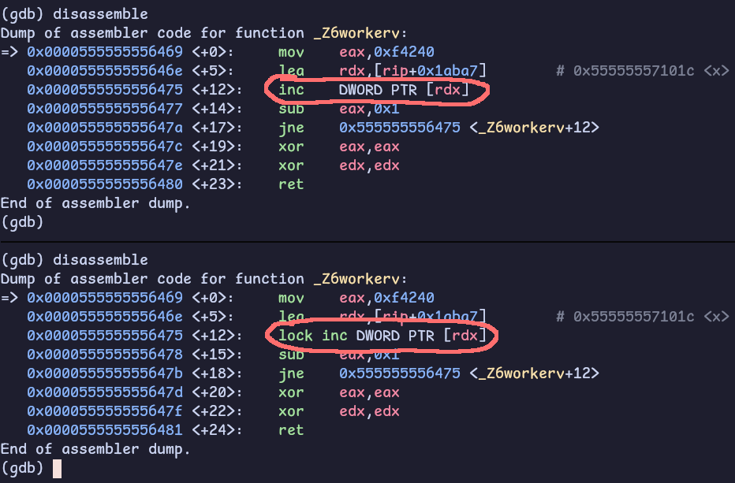

### Defining the atomic op

So now we can define an atomic operation: one that reads, optionally modifies,
and writes as a single indivisible step, guaranteeing:

- Nobody reads a half-written value (no tearing)
- No lost updates (no two cores RMW the same value at once)
- Once it completes, every core sees the new value

The `LOCK` prefix is what buys this. It asserts the processor's `LOCK#` signal
for the duration of the instruction, turning it atomic. It can only prefix a
specific set of memory-destination instructions: `ADD`, `INC`, `DEC`, `XADD`,
`XCHG`, `CMPXCHG`, and friends [[11](#references)].

How the lock itself works has history. On the 486, `LOCK` asserted a literal
**bus lock**, it locked the whole memory bus for the operation, which was a
massive performance hit because *everything* touching memory had to wait.
Starting with the Pentium Pro / P6, it became a **cache lock**: the core takes
exclusive ownership of the affected cache line via the coherence protocol (line
goes M/E) for the single instruction, no global bus lock needed. The bus lock
only comes back if the locked memory is uncacheable, or if the access straddles
a cache-line boundary (a "split lock"). Both are rare [[9](#references)]. The
`LOCK#` signal itself isn't a register or a bit, it's a physical signal on the
interconnect [[10](#references)].

### "Lock-free"

One correction to a thing I believed going in. I assumed this meant atomics
"aren't really lock-free, the lock is just in hardware." That's wrong, and it's
a common confusion of two different meanings of "lock." **Lock-free is a
progress guarantee**, it means suspending any single thread can never stop the
others from making progress.

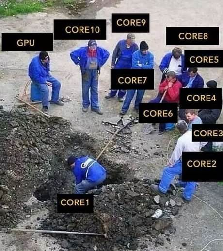

The `LOCK` prefix holds a cache line for *one
bounded instruction* that can't be interrupted mid-flight, so no thread can ever
block another indefinitely with it. That makes `lock xadd` genuinely lock-free.

A **mutex** is *not* lock-free: a thread that grabs it and gets descheduled
stalls everyone waiting.
So "lock-free" doesn't mean "no serialization ever
happens," it means the serialization is bounded and non-blocking. The `LOCK`
prefix being spelled *lock* is a false friend.

## std::atomic

Now that we've hand-rolled a (probably shit) atomic counter, let's see how the 
C++ stdlib does it.

`std::atomic<T>` is an atomic type. Concurrent reads and writes are
well-defined, and you can additionally control how surrounding non-atomic memory
is ordered via `std::memory_order` (which connects straight back to those fence
instructions.. more on that later). Cppreference also notes the standard requires every RMW to
read the latest value in the modification order, so **RMWs always see the
freshest value** [[2](#references)].

> `std::atomic<T>` works on any *trivially copyable* `T`, basically a flat block
> of bytes you could `memcpy`. Mostly scalars, but trivially-copyable classes
> count too. I won't go down the move-semantics hole here [[12](#references)].

### A quick init gotcha

Fedor Pikus mentioned not to write `std::atomic_int x = 0;`. He didn't say why, so,
tangent. If you set `-std=c++11`:

```text
error: use of deleted function
‘std::atomic<int>::atomic(const std::atomic<int>&)’
```

`std::atomic` has a deleted copy constructor (atomics aren't copyable). `x = 0`
is *copy*-initialization: it builds a temporary `atomic_int` from `0` via the
converting constructor, then wants to copy-construct `x` from it, and that copy
ctor is deleted. C++17's guaranteed copy elision makes `= 0` compile now, but
the idiom is **direct-initialization**, which calls the converting ctor
straight, no copy:

```cpp
std::atomic_int x{}; // or x{0}
```

`++` is overloaded but I'll be explicit with `fetch_add`:

```cpp
#include <atomic>
#include <print>
#include <thread>

std::atomic_int x{};

void worker(void) {
  for (int i = 0; i < 1000000; i++)
    x.fetch_add(1);
}

int main(void) {
  std::thread t1(worker), t2(worker);
  t1.join();
  t2.join();
  std::print("{}\n", x.load());
  return 0;
}
```

```text
$ g++ -O1 -std=c++23 std_atomic.cpp
$ ./a.out
2000000
```

Now the disassembly:

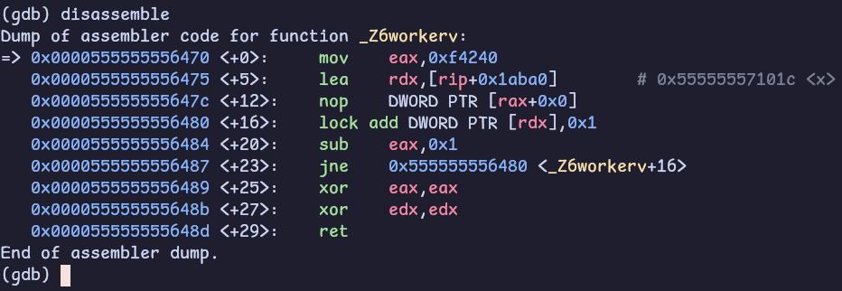

Same `lock` prefix. The standard library picked `add` over `inc`, but it's the
identical hardware primitive we hand-rolled. If I switch my asm to `lock add`
too, the loops are line-for-line identical.

> That `nop DWORD PTR [rax+0x0]` before the loop isn't doing anything, it's a
> multi-byte NOP the compiler inserts as **alignment padding** to put the loop
> head on a 16-byte boundary so it sits cleanly in an instruction-cache line.
> Pure padding, never meaningfully executed.

So the most basic multithreaded counter is *just the lock prefix*, and
`std::atomic` is the portable wrapper that emits it for you. Tip of the iceberg,
but a real foundation.

## Benchmarks

If `lock` is the whole story for the counter, let's measure it. Four cases, the
first two are the **wrong** answers (no locking), included on purpose:

```cpp
#include <atomic>
#include <benchmark/benchmark.h>
#include <thread>

// NOTE: Omitted backslashes for better syntax highlighting
#define M_BENCHMARK(name, t, e)
  static void _##name(benchmark::State &s) {
    for (auto _ : s) {
      t x{0};
      auto w = [&] { for (int i = 0; i < 1000000; i++) e; };
      std::thread t1(w), t2(w);
      t1.join();
      t2.join();
      benchmark::DoNotOptimize(x);
    }
  }
  BENCHMARK(_##name);

M_BENCHMARK(naive, int, x++);
M_BENCHMARK(no_lock, int, asm("inc %0" : "+m"(x)));
M_BENCHMARK(lock, int, asm("lock inc %0" : "+m"(x)));
M_BENCHMARK(std_atomic, std::atomic_int, x.fetch_add(1));

BENCHMARK_MAIN();
```

```text
$ g++ -g -O1 -std=c++23 benchmark.cpp -lbenchmark
$ ./a.out
Run on (8 X 4900 MHz CPU s)
CPU Caches:
  L1 Data 32 KiB (x8)
  L1 Instruction 32 KiB (x8)
  L2 Unified 256 KiB (x8)
  L3 Unified 12288 KiB (x1)
Load Average: 0.72, 0.83, 0.85
***WARNING*** CPU scaling is enabled, [...]

Benchmark            Time             CPU   Iterations
_naive         2667488 ns        52334 ns         1000
_no_lock       2543247 ns        58533 ns         1000
_lock         31105183 ns        66661 ns          100
_std_atomic   32055394 ns        59998 ns         1000
```

> Wall times bounce run-to-run because CPU frequency scaling is on, the
> *relative* picture is stable.

Two things fall out.

**1. `std::atomic` matches the hand-rolled `lock add` within noise.**  
The abstraction costs nothing, it's the same instruction.

**2. The unlocked versions are ~12× faster, but not because they have "zero
coherence overhead."**  
That line was in my notes and it's wrong. The cache line
is contended either way, there's coherence traffic regardless. The real
difference is what the core is *allowed to do* with it.  

Without `LOCK`, a store
can sit in the store buffer and the core pipelines straight into the next
iteration, reading its own buffered value via store-forwarding. It never has to
wait for each increment to become globally visible. With `LOCK`, every single
increment must be globally visible before the next instruction can retire, so
the core can't pipeline through it. 

The lock converts a pipelined burst into a synchronous round-trip per op. And
the *same* buffering
plus non-atomicity that makes the unlocked version fast is exactly what makes it
lose ~half the counts.

> On the wall vs CPU split. It's tempting to read the ~40ms wall vs ~60µs CPU as
> "cores stalled waiting for cache-line ownership." Don't. Google benchmark's
> CPU time is the *benchmarking thread's* CPU time, and that thread spends most
> of its life asleep in `join()` waiting on the workers.

## Memory Ordering

We covered the atomicity half. The lost-increment problem is fixed by `LOCK`
because no other core can interleave a load between our read and our write.
Done. Now the *other* axis.

First, terms. **Program order** is the order operations appear in your source,
what you *wrote*. The CPU and the memory model don't promise to execute or *make
visible* memory operations in that order. 

> "Program order" and "weak vs strong ordering" are different things.
> Program order is source order, weak vs strong describes the memory model's
> *reordering rules*. x86 is **strongly** ordered, it's a TSO (total store
> order) machine, more on that in a sec (:

We already saw a flavor of disorder in the unsynchronized counter. The deeper
version: on a multicore machine, one thread can observe another thread's writes
happening in a *different order* than they were issued, and different reader
threads can even disagree with each other.

The mechanism is the **store buffer** again. Stores land in a per-core FIFO
before they reach the coherent cache. The issuing core reads its own buffered
writes (store-forwarding), but other cores can't see them until they drain. So a
store you "did" can be invisible to everyone else for a while.

### memory_order, the portable knob

`std::memory_order` is how you express ordering portably, it specifies how
regular and atomic accesses get ordered around an atomic operation
[[16](#references)]. The three levels we'll see in this section:

- `seq_cst` - the default, gives a single total order all threads agree on
- `release` / `acquire` - pairwise happens-before between one writer and one reader
- `relaxed` - atomicity only, no ordering constraints

Start from the bottom. `relaxed` is atomicity with zero ordering, which makes it
the perfect instrument for *watching* a reorder happen in the wild.

### The SB litmus test

The cleanest demonstration is **SB (store buffering)**, straight out of the
x86-TSO paper [[13](#references)]. Two locations, both 0:

```text
# Proc 0          # Proc 1
MOV  [x] <- 1     MOV  [y] <- 1
MOV  EAX <- [y]   MOV  EBX <- [x]

# Allowed Final State: Proc 0: EAX=0 OR Proc 1: EBX=0
```

Here's what happens. The two processors each have their own
store buffers and share the same memory. Nothing new. Same model we've
been working with.

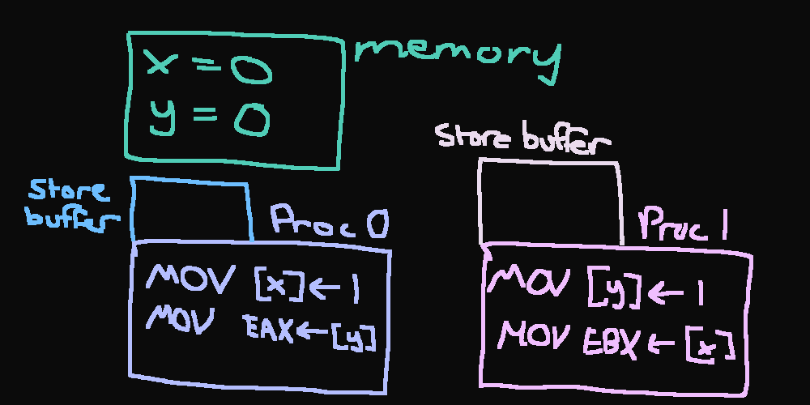

Now, `p0` does `x = 1`. That write goes into core 0's **store buffer**, not
memory.

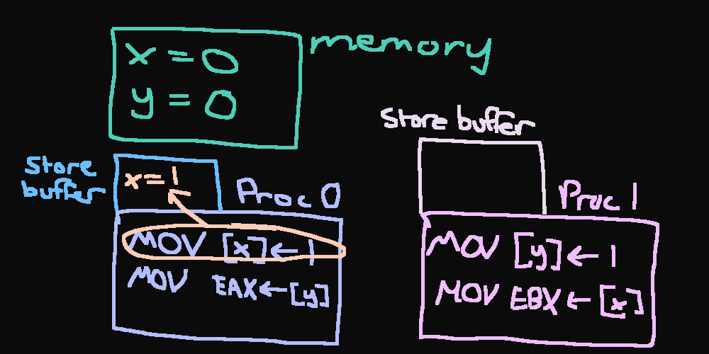

`p1` does `y = 1`...

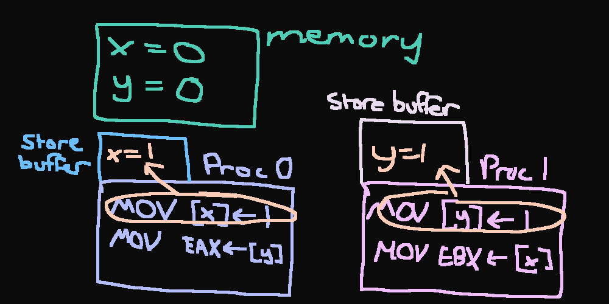

`p0` reads `y`. Core 1's `y = 1` is still sitting in *core 1's* store buffer,
so core 0 reads `y = 0` from memory (core 1 reads `x = 0`).

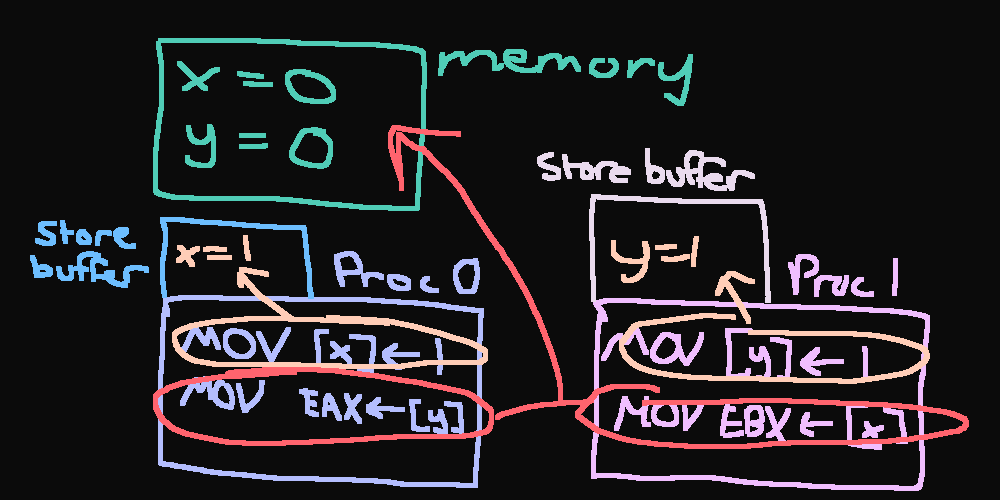

Both buffers drain *afterward*. Final state: `EAX = 0, EBX = 0`. Wtf.

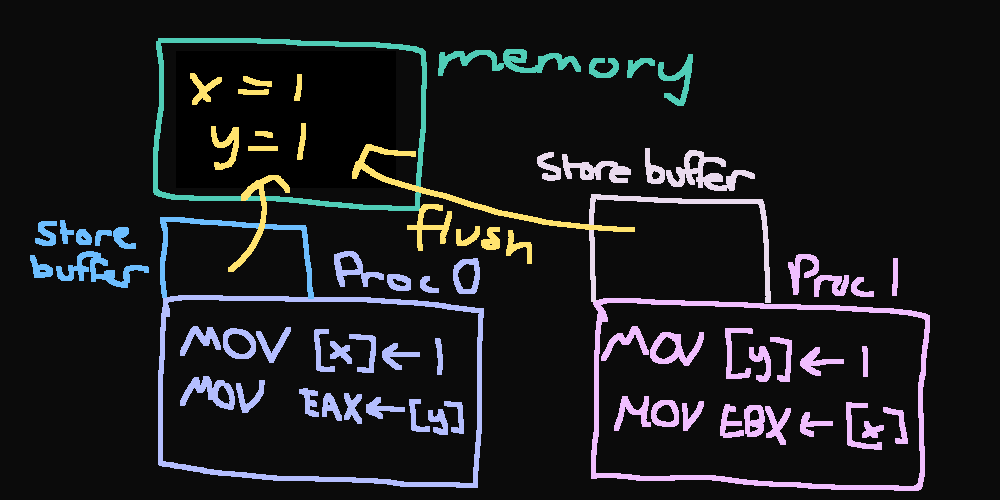

Under **sequential consistency**, `EAX == 0 && EBX == 0` is impossible. One
store must come first, so at least one load should see a 1. But on real x86 it's
observable: both stores sit in their respective store buffers while both loads
go to memory and read stale zeros.

This is "relaxed-memory behavior," and on x86 it's the *one* reorder TSO
permits, **StoreLoad** (a store followed by a load to a different address).
C++ version:

```cpp
#include <print>
#include <thread>

int x = 0, y = 0;
int eax = -1, ebx = -1;

void p0(void) {
  x = 1;
  eax = y;
}
void p1(void) {
  y = 1;
  ebx = x;
}

int main(void) {
  int i = 0;
  while (1) {
    x = y = 0;
    eax = ebx = -1;
    std::thread t0{p0}, t1{p1};
    t0.join();
    t1.join();
    i++;
    if (eax == 0 && ebx == 0)
      break;
  }
  std::print("after {} iterations: eax={}, ebx={}\n", i, eax, ebx);
  return 0;
}
```

```text
$ g++ -g -O1 --std=c++23 sb.cpp -o sb.out
$ ./sb.out
after 54396 iterations: eax=0, ebx=0
```

This program is **undefined behavior**: `x` and `y` are plain 
`int`s touched by two threads with no atomic operation, which is a data race 
in the C++ model.

> The 9700K has no SMT, so the two threads land on separate physical cores,
> each with its own store buffer. Across runs, a wide range of
> iterations until it was caught was observed. It feels random, but absolutely
> happens.

It "works" here purely because of how x86 lowers plain loads and stores. I'm
keeping it because it's the clearest possible illustration, but the
standards-correct way to write SB is with relaxed atomics for the shared
locations:

```cpp
#include <atomic>
#include <print>
#include <thread>

std::atomic_int x{}, y{};
int eax = -1, ebx = -1;

void p0(void) {
  x.store(1, std::memory_order_relaxed);
  eax = y.load(std::memory_order_relaxed);
}
void p1(void) {
  y.store(1, std::memory_order_relaxed);
  ebx = x.load(std::memory_order_relaxed);
}

int main(void) {
  int i = 0;
  while (1) {
    x.store(0);
    y.store(0);
    eax = ebx = -1;
    std::thread t0{p0}, t1{p1};
    t0.join();
    t1.join();
    i++;
    if (eax == 0 && ebx == 0)
      break;
  }
  std::print("after {} iterations: eax={}, ebx={}\n", i, eax, ebx);
  return 0;
}
```

```text
$ g++ -g -O1 --std=c++23 sb_atomics.cpp -o sb_atomics.out
$ ./sb_atomics.out
after 5613 iterations: eax=0, ebx=0
```

Now let's look at the disassembly of each:

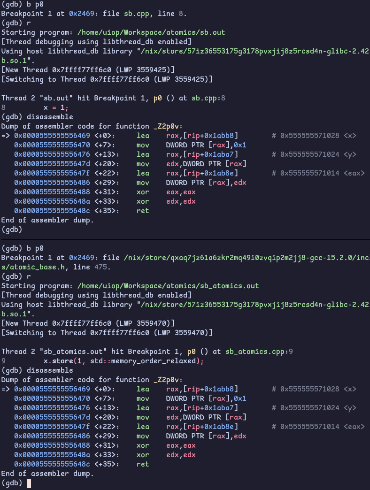

It's identical (O‿o) `x.store(1, std::memory_order_relaxed)` is
`mov DWORD PTR [x], 1` (vice versa with `y` not shown) on both versions.
No `lock`, no fence, the exact instructions the UB version emitted.

The **correct code and the broken code are the same binary**. That's the trap.
The racy version doesn't run slower or look different here, it's the same
`mov`s, so it passes every test you run on this machine and you ship it. But one
of these is a program the standard defines, and the other is a program the
compiler is *allowed to do anything to* the next time you bump a flag, a gcc
version, or an inlining decision. Same binary today is not same binary tomorrow.
And that's only half the trap, the other half shows up in release/acquire below,
where annotations that cost zero instructions on x86 cost real ones on ARM.

### Fixing it with a fence

The manual's line is that when ordering must be strictly enforced, you use
barrier instructions, `lfence`, `sfence`, `mfence`, to force memory ops to
proceed in program order. `mfence` specifically [[14](#references)] serializes
*all* loads and stores: everything before it becomes globally visible before
anything after it. These are "memory barriers" or "fences," a standard
concurrency primitive [[15](#references)]. (`serialize`, `cpuid`, `iret` are
also serializing, but they're heavier. The fences are the cheap, targeted
option.)

The fix: drop an `mfence` between the store and the load on each thread, so the
store buffer drains before the load reads.

```diff
 void p0(void) {
   x.store(1, std::memory_order_relaxed);
+  asm volatile("mfence" ::: "memory");
   eax = y.load(std::memory_order_relaxed);
 }
```

Disassembly confirms the `mfence` lands right after
`mov DWORD PTR [rax], 0x1`. Left it looping for **10+ minutes**, the SB state
never showed up again.

> The `"memory"` clobber is load-bearing too, it's a *compiler* barrier telling
> gcc not to reorder the load above the asm. The `mfence` is the *hardware*
> barrier. You need both.

### The std::atomic equivalent of mfence

Hand-rolled asm isn't portable. The 1:1 equivalent of a bare `mfence` is a
standalone fence:

```diff
-  asm volatile("mfence" ::: "memory");
+  std::atomic_thread_fence(std::memory_order_seq_cst);
```

Here's the interesting bit, the disassembly of the `seq_cst` fence:

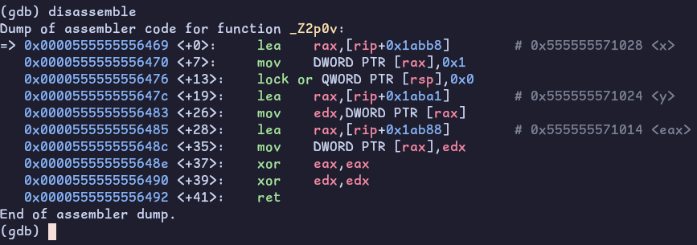

It's not an `mfence`, it's a `lock or` of zero into the top of the stack. That's
a **dummy locked no-op**: `or [rsp], 0` changes nothing, but the `LOCK` prefix
triggers the full store-buffer drain and StoreLoad barrier we need. Gcc picks
this because on most microarchitectures a dummy locked op is *cheaper* than
`mfence` while giving the same StoreLoad ordering.

> Remember, `lock` can only prefix specific instructions, and `or` is one of the
> cheapest.

### Release and acquire

`seq_cst` is where shit gets real, a real barrier instruction, real cost. But most
synchronization doesn't need a global total order, it needs *pairwise* ordering
between one writer and one reader. That's **release/acquire**, and the canonical
example is message passing: a producer fills a payload then flips a flag, a
consumer waits on the flag then reads the payload.

```cpp
#include <atomic>
#include <print>
#include <thread>

int data = 0;
std::atomic_bool ready{false};

void producer(void) {
  data = 42;                                       // (1) write payload
  ready.store(true, std::memory_order_release);    // (2) release
}
void consumer(void) {
  while (!ready.load(std::memory_order_acquire));  // (3) acquire
  std::print("{}\n", data);  // guaranteed 42
}

int main(void) {
  std::thread t0(producer), t1(consumer);
  t0.join();
  t1.join();
  return 0;
}
```

> Note that `data` being a plain `int` is UB!!

```text
$ g++ -O0 --std=c++23 rel_acq.cpp
$ ./a.out
42
```

The guarantee comes from a **happens-before chain**. (1) is sequenced-before the
release store (2) in program order, the release store *synchronizes-with* the
acquire load (3) because they're the same atomic and the load reads what the
store wrote, (3) is sequenced-before the read of `data`. Chain it together and
`data = 42` *happens-before* the consumer's read. No `mfence`, no `seq_cst`, no
torn read. You guessed it, now we're gonna disassemble it:

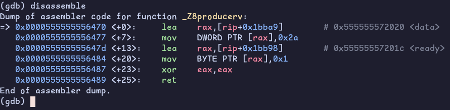

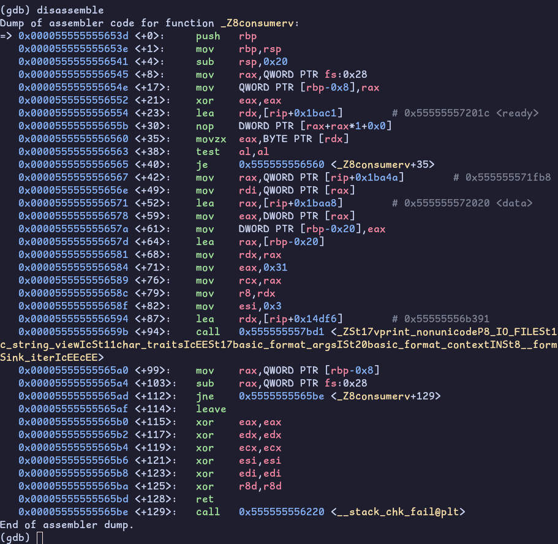

The release store is a plain `mov`.
The acquire load is a plain `movzx` in the spin loop. **No `lock`, no `mfence`,
nothing extra.** That's what "free on x86" means: TSO already gives you
store-release and load-acquire semantics for plain `mov`s, so the ordering
annotation costs *zero* instructions. Compare that to the `seq_cst` fence above,
which cost a `lock or`. Same header, completely different price depending on
which reorder you're fighting.

One honesty note: on x86 you **can't make this demo fail at runtime** even with
`relaxed` instead of acquire/release. TSO won't let the consumer observe `data
== 0`. The proof that the ordering matters is twofold, the asm shows it's free,
and the *portability* argument: on a weakly-ordered machine like ARM,
downgrading to `relaxed` here genuinely breaks: which is the entire reason the 
annotation exists [[16](#references)].

### Breaking it on ARM

I'm gonna be running this on my Raspberry Pi 5. Before we get into it check out
my overkill case B)


Anyways... here's the program I'll be using for this demonstration:

```cpp
#include <atomic>
#include <iostream>
#include <thread>

alignas(64) std::atomic_int data{0};
alignas(64) std::atomic_bool ready{false};
int observed = -1;

void producer(void) {
  data.store(42, std::memory_order_relaxed);
  ready.store(true, std::memory_order_relaxed);
}

void consumer(void) {
  while (!ready.load(std::memory_order_relaxed));
  observed = data.load(std::memory_order_relaxed);
}

int main(void) {
  int i = 0;
  while (1) {
    data.store(0);
    ready.store(false);
    observed = -1;
    std::thread t0(producer), t1(consumer);
    t0.join();
    t1.join();
    i++;
    if (observed == 0)
      break;
  }
  std::cout << "iterations: " << i << "\n";
  return 0;
}
```

Couple of things to note here. First, the data payload has been upgraded to an 
`std::atomic_int`. With the payload relaxed-atomic, the whole program is
defined, so when it prints 0 nobody can wave it off as "that's just UB bro."

Second, `alignas(64)` on **both**. Remember when we went over cache lines
earlier? Well since `data` and `ready` are adjacent globals, they would be on 
the same cache line (64 bytes). So when the consumer fetches `ready`, it gets
`data` in the same line - even with relaxed loads. Aligning them to 64 byte
boundaries makes it so they get their own line.. meaning different coherence
states, held by different cores, and transferred independently. This makes the
window for the consumer to see `ready==true` and `data==0`, since the
lines arrive in different order, actually has a chance to open.

```text
$ g++ -O1 demo.cpp
$ ./a.out
iterations: 127290
```

You know the drill, here's the disassembly:

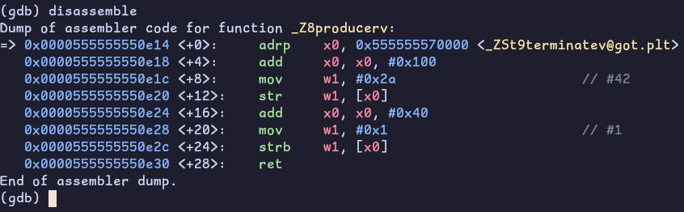

Both stores are bare `str`/`strb`. The CPU is free to retire them out of order
to the coherence gods. `ready=true` can become visible to another core *before*
`data=42` does.

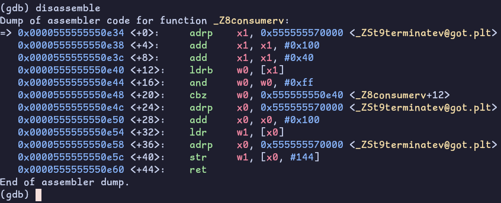

Same deal on the consumer side. Bare `ldr`, no acquire. Nothing prevents this
load from being satisfied from a stale cache line state while `ready`'s line
already arrived.

> The C++ memory model permits this. `std::memory_order_relaxed` makes no
> ordering guarantees between different variables. The compiler emitted the
> weakest legal sequence. ARM's weak memory model exposes it.

I've been running the same program on x86 this entire time since I've been
writing this section. 11 minutes now and nothing. x86 TSO prevents this from
happening!

Now let's make some changes to our program:

```diff
 void producer(void) {
   data.store(42, std::memory_order_relaxed);
-  ready.store(true, std::memory_order_relaxed);
+  ready.store(true, std::memory_order_release);
 }

 void consumer(void) {
-  while (!ready.load(std::memory_order_relaxed));
+  while (!ready.load(std::memory_order_acquire));
   observed = data.load(std::memory_order_relaxed);
 }
```

We can see in the disassembly that `strb` changed to `stlrb` and `ldrb` to
`ldarb`! This simple instruction change that's free for my 9700K costs actual
hardware on the RPI.

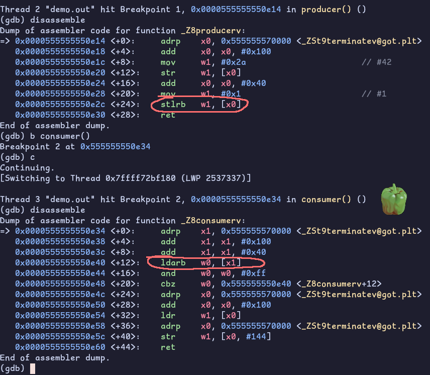

> Double check your memory ordering by using `-fsanatize=thread` (TSan). It
> checks memory accesses at runtime by catching threads touching the same data
> without proper synchronization.

> Check out [herdtools7](https://github.com/herd/herdtools7). Its a tool suite
> to test weak memory models if you want something a little more. Definetly out
> of scope for this blog!

## The Ordering Ladder

So `std::memory_order` isn't one knob, it's a choice of strength and cost. Find
a full list at [[17](#references)]. The following are briefs on the ones I used.

### Relaxed

Atomicity only, no ordering, and the cheapest. The counter could've used this,
`fetch_add` doesn't need ordering to count right (the `join` is what publishes
the final value to `main`).

### Acquire/Release

Pairwise happens-before between a release and the acquire that reads it. Free
plain `mov`s on x86, TSO already disallows LoadLoad, LoadStore, and StoreStore
reorders.

### Sequential

A single total order all threads agree on (the default). StoreLoad is the one
reorder x86 permits, so this is the only level that costs a barrier (a
`lock or`, or `mfence`).

`consume` exists too, but skip it. It's deprecated in C++26 and every real
compiler just promotes it to `acquire` because the dependency tracking it
specified was never implemented correctly.

## Conclusion

### Atomicity and ordering are two different things

Atomicity is the `LOCK` prefix, bounded exclusive ownership of a cache line through an entire RMW, so no update is lost and no value is torn. Ordering is a *separate* axis, how an
operation constrains the memory accesses around it.

### x86 (TSO) does most of the ordering for free, and that's a trap

Store-release and load-acquire are just plain `mov`s here, and the only reorder
the hardware permits is StoreLoad, which a single fence fixes. The danger is
that code which is subtly wrong under the C++ memory model still *runs correctly
on your x86 box*, then explodes on ARM. The annotations aren't decoration,
they're what makes the code portable and what tells the compiler the truth about
your intent.

### std::atomic is the portable abstraction over both

It emits the `LOCK`
prefix for atomicity, and exactly the barriers (often zero, on x86) your chosen
`memory_order` requires. We watched it compile to the same `lock add` we
hand-rolled, and its `seq_cst` fence to a `lock or` standing in for our
`mfence`.

### Lock-free is a progress guarantee

`lock xadd` is lock-free, its serialization is bounded and can't block other threads
indefinitely. A mutex isn't, because a suspended lock-holder stalls everyone.
That's the real distinction behind "atomics are faster than a mutex," not "no
locks anywhere."

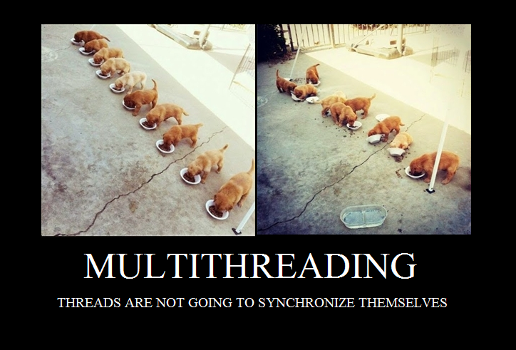

> No way I'll be assessed in the OA about any of this but honestly this rabbit
> hole was probably more beneficial (and fun!) to me than grinding LeetCode.

## References

1. [Fedor Pikus, "C++ atomics, from basic to advanced. What do they really do?",
CppCon 2017](https://www.youtube.com/watch?v=ZQFzMfHIxng)
2. [cppreference, `std::atomic`](https://en.cppreference.com/cpp/atomic/atomic)
3. [Wikipedia, read-modify-write](https://en.wikipedia.org/wiki/Read%E2%80%93modify%E2%80%93write)
4. [Stack Overflow, Linus on atomic instructions and the store buffer](https://stackoverflow.com/a/43837970)
5. [Wikipedia, MESI protocol](https://en.wikipedia.org/wiki/MESI_protocol)
6. [felixcloutier, `LOCK` prefix](https://www.felixcloutier.com/x86/lock)
7. [felixcloutier, `XADD`](https://www.felixcloutier.com/x86/xadd)
8. (Hard-copy) AMD64 Architecture Programmer's Manual, vol 2 (System Programming), rev 3.07, Sept 2002, on locked operations and the write buffer (pp ~194-205)
9. [Intel, Implementing Scalable Atomic Locks for Multi-Core Intel EM64T and IA32 Architectures](https://web.archive.org/web/20090227095314/http://software.intel.com/en-us/articles/implementing-scalable-atomic-locks-for-multi-core-intel-em64t-and-ia32-architectures)
10. [Stack Overflow, on the `LOCK#` signal](https://stackoverflow.com/a/65681049)
11. [x86 instruction reference, `LOCK`-prefixable instructions](https://asm-docs.microagi.org/x86/lock.html)
12. [cppreference, TriviallyCopyable](https://en.cppreference.com/cpp/named_req/TriviallyCopyable)
13. [Sewell et al., "x86-TSO: A Rigorous and Usable Programmer's Model for x86 Multiprocessors," CACM](https://www.cl.cam.ac.uk/~pes20/weakmemory/cacm.pdf)
14. [felixcloutier, `mfence`](https://www.felixcloutier.com/x86/mfence)
15. [Wikipedia, memory barrier](https://en.wikipedia.org/wiki/Memory_barrier)
16. [ARM Developer - Memory ordering](https://developer.arm.com/documentation/102336/0100/Memory-ordering)
17. [cppreference, `std::memory_order`](https://en.cppreference.com/cpp/atomic/memory_order)
