# Getting My Kernel to Manage Its Own Memory
<time datetime="2026-09-15">Sep, 15 2026</time>

## Contents
- [Intro](#intro)
- [Where I Left Off](#where-i-left-off)
- [Asking the BIOS Where the RAM Is](#asking-the-bios-where-the-ram-is)
    - [The E820 loop](#the-e820-loop)
    - [Reading it back in the kernel](#reading-it-back-in-the-kernel)
    - [Everything above 1 MiB is mine](#everything-above-1-mib-is-mine)
- [Picking an Allocator](#picking-an-allocator)
    - [Buddy](#buddy)
    - [Slab](#slab)
    - [Why I went with a bitmap anyway](#why-i-went-with-a-bitmap-anyway)
- [The Bitmap](#the-bitmap)
    - [Sizing it](#sizing-it)
    - [Marking its own frames used](#marking-its-own-frames-used)
    - [The excess bits](#the-excess-bits)
- [Alloc and Free](#alloc-and-free)
- [Going Higher Half](#going-higher-half)
    - [Why negative 2 GB](#why-negative-2-gb)
    - [Canonical addresses do the bounds checking for you](#canonical-addresses-do-the-bounds-checking-for-you)
    - [The linker script split](#the-linker-script-split)
- [Building the Real Page Tables](#building-the-real-page-tables)
    - [4 KB instead of 2 MB](#4-kb-instead-of-2-mb)
    - [The physmap trick](#the-physmap-trick)
    - [Mapping the kernel with real permissions](#mapping-the-kernel-with-real-permissions)
    - [The bitmap pointer has to move](#the-bitmap-pointer-has-to-move)
- [Entering User Mode](#entering-user-mode)
- [Where This Leaves Me](#where-this-leaves-me)
- [References](#references)

## Intro

I'm back doing OS dev, and the honest state of things is that the kernel does
the bare minimum. I hardcoded *a lot* of quick hacks to speedrun my way to ring
3. It was still one of the hardest things I've ever built and the thing I'm most
proud of, but there's a pile of stuff I should've done properly the first time.

The goal now is networking and running on real hardware, with a shell so the
thing is actually useful. But before any of that, the memory situation is fuzzy
and load-bearing, and I don't trust it. So this post is me rebuilding the
physical and virtual memory managers from the ground up. Thesis:

> Almost everything my kernel "knew" about memory was a hardcoded offset that
> happened to work. Replacing the magic numbers with an actual physical
> allocator and a real higher-half address space is the whole job.

## Where I Left Off

After the bootloader walks me through real mode into 32-bit protected mode and
finally 64-bit long mode, control lands in `_start64`, which sets up a stack and
calls into C:

```asm
section .text
_start64:
    ;; Zero .bss while RSP still points at low address bootstrap stack
    cld
    mov   rdi, __bss_start
    mov   rcx, __bss_end
    sub   rcx, rdi
    xor   eax, eax
    rep   stosb

    mov   rsp, kern_stack + KERN_STACK_SIZE
    call  kern_main
  .hang:
    hlt
    jmp   .hang
```

```c
void kern_main(void) {
  __init();
  __enter_user_mode();
}
```

That's it. Initialize some devices, jump to user mode, and when the user program
returns from `main` the whole system just hangs. There's no concept of a
process, and no virtual memory protection beyond whatever the CPU gives me for
free.

> Specifically, `__init()` sets up COM1 for serial output, update GDT TSS IDT,
> disables PIC (forgot why), sets up syscall shit (swapgs, efer sce, star/lstar,
> etc.)

And "whatever the CPU gives me for free" was set up like this in the bootstrap
assembly:

```asm
    ;; PDT with first 1GB identity mapped with 2MB pages
    mov   edi, PDT_PMA
    mov   ebx, PTTE_P | PTTE_RW | PTTE_PS
    mov   ecx, PTT_ENTS ; 512 entries = 1GB
  .identity_loop:
    mov   [edi], ebx
    add   ebx, 0x200000 ; Next 2MB phys frame
    add   edi, 8
    loop  .identity_loop
```

A flat identity map of the first gigabyte with 2 MB pages. I cant't even verify
if I *have* a gigabyte of RAM. And the "user page" was just me finding the page
directory entry containing my hardcoded `USER_OFFSET` and flipping the U/S bit:

```c
#define PDT 0x3000
#define PDTE_USER (USER_OFFSET / 0x200000) // Each entry maps 2MB
void vm_init(void) {
  uint64_t *pdt = (uint64_t *)PDT;
  pdt[PDTE_USER] |= PTT_US;
}
```

Then I hand `USER_OFFSET` and a stack address straight to `iretq`. There is no
memory management here. Everything is a hardcoded offset that happens to land
somewhere real. So before I add processes, I want page tables I actually trust,
and to trust them I need to know what physical memory even exists. That means I
need an allocator, and that means I first need a map.

## Asking the BIOS Where the RAM Is

The canonical way to get a physical memory map on x86 is `INT 15h, EAX=E820h`.
The catch is that it's a BIOS interrupt, so it only exists in 16-bit real mode. I
leave real mode inside my MBR, so the query has to happen there, before I switch
into protected mode.

### The E820 loop

You call it in a loop. Each iteration hands you one memory region, and `EBX`
carries the continuation value until it resets to zero, at which point the list
is done. Thank god past-me commented this thing.

```asm
query_addr_map:
    mov   eax, 0xE820
    xor   ebx, ebx              ; EBX must be 0 to start
    xor   bp, bp                ; Keep entry count in BP
    mov   edx, 0x0534D4150      ; "SMAP"
    mov   di, MMAP_ENT_START    ; Prevent getting stuck in INT 15h
    mov   ecx, 24               ; Ask for 24 bytes
    mov   [es:di + 20], dword 1 ; Force valid ACPI 3.X entry
    int   0x15
    jc    error
    mov   edx, 0x0534D4150      ; "SMAP" - some BIOSs trash this register
    cmp   eax, edx              ; EAX set to "SMAP" on success
    jne   error
    test  ebx, ebx              ; EBX=0 implies list only 1 entry (worthless)
    je    error
    jmp   .jmpin
  .e820lp:
    mov   eax, 0xE820           ; EAX gets trashed on every INT 15h call
    mov   [es:di + 20], dword 1 ; Force valid ACPI 3.X entry
    mov   ecx, 24               ; Ask for 24 bytes (again)
    int   0x15
    jc    .e820f                ; End of list already reached
    mov   edx, 0x0534D4150      ; "SMAP" - some BIOSs trash this register
  .jmpin:
    jcxz  .skipent
    cmp   cl, 20                ; Got a 24 byte ACPI 3.X response?
    jbe   .notext
  .notext:
    mov   ecx, [es:di + 8]      ; Get lower uint32_t of memory region length
    or    ecx, [es:di + 12]     ; OR it with upper uint32_t to test for zero
    jz    .skipent              ; If length uint64_t is 0, skip entry
    inc   bp                    ; Got good entry, increase count
    add   di, 24                ; Move to next storage spot
    cmp   di, MMAP_ENT_END - 24 ; Room for more?
    ja    .e820f                ; Out of space, stop early
  .skipent:
    test  ebx, ebx              ; If EBX resets to 0, list is complete
    jne   .e820lp
  .e820f:
    mov   [es:MMAP_ENT], bp     ; Store entry count
    clc                         ; There is "jc" on end of list so clear carry
```

I write the entries to a fixed physical address and stash the count right before
them. Like everything else in the bootloader, these are hardcoded, but at least
now they live in `config` and get shared into both the assembler and the C via
generated headers:

```make
MMAP_ENT       = 0x500
MMAP_ENT_START = 0x504
MMAP_ENT_END   = 0x1000
```

> These addresses take the real-mode address space[^1] into account so I'm not
> scribbling over something the BIOS still cares about. The whole region below 1
> MiB is a minefield of reserved junk.

I force ACPI 3.0 (24-byte) entries by pre-seeding the extended-attributes dword
to 1 before each call. The format of one entry[^2]:

- First `u64` is the base address
- Second `u64` is the length (if zero, ignore the entry)
- Next `u32` is the region type
    - Type 1: usable RAM
    - Type 2: reserved
    - Type 3: ACPI reclaimable
    - Type 4: ACPI NVS
    - Type 5: bad memory
- Next `u32` is the ACPI 3.0 extended attributes
    - Bit 0 clear: ignore the whole entry
    - Bit 1 set: non-volatile
    - Rest undefined

### Reading it back in the kernel

Before parsing anything, I dumped the raw bytes in GDB to make sure my mental
model of the layout was right. Count first, then 24-byte entries back to back:

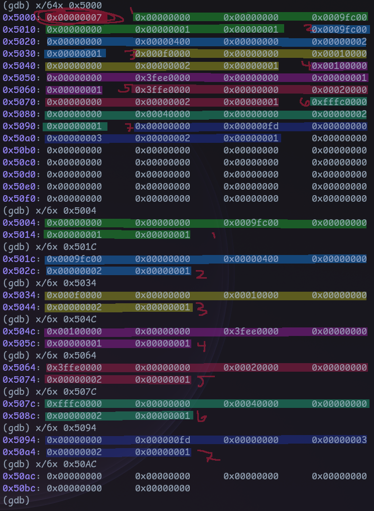

Seven entries. The count `0x00000007` sits at the front, then each entry is
base, length, type, ext-attrs. To make that legible I annotated the parsed
output from my serial console:

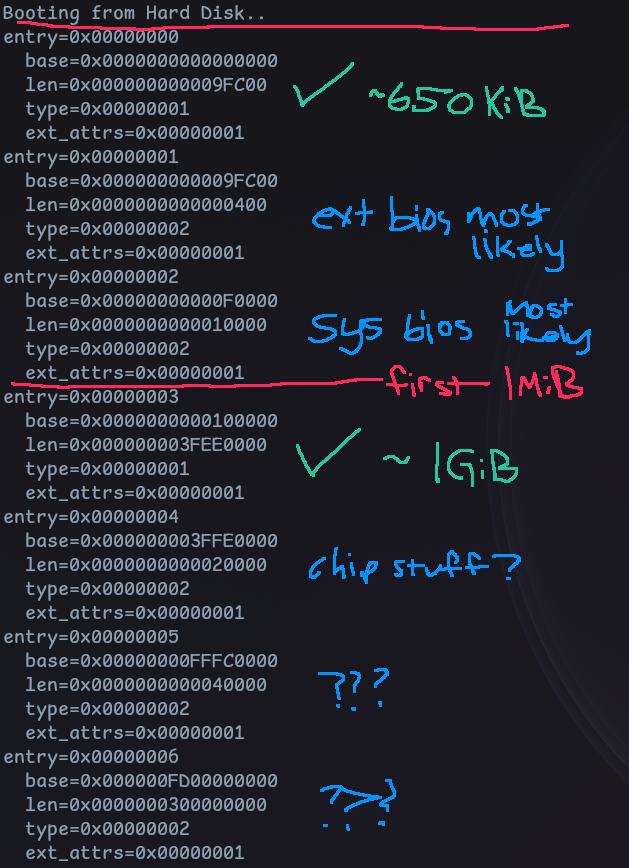

You can read the whole machine off that picture. A ~650 KiB usable chunk at the
bottom, the extended and system BIOS regions, the 1 MiB line, then the big ~1 GiB
usable region starting at `0x100000`, and some chipset reserved ranges up top.
That ~1 GiB region is the prize.

Modeling one entry in C is straightforward. The type is an enum so the code reads
like the wiki table, and I pack the struct so it maps byte-for-byte onto what the
BIOS wrote:

```c
typedef enum uint32_t {
  AVAILABLE = 1,
  RESERVED,
  ACPI_RECLAIMABLE,
  ACPI_NVS,
  BAD_MEMORY,
} pm_ent_type;

struct pm_region {
  uint64_t base;
  uint64_t len;
} __attribute__((packed));

struct pm_ent {
  struct pm_region region;
  pm_ent_type type;
  uint32_t ext_attrs; // NOTE: ACPI 3.0 extended attributes
} __attribute__((packed));
```

Here's where I hit the wall that reorganized this whole post: I sat down to write
a proper parser, one that validates every entry and coalesces overlaps, and
realized I can't. I don't know the entry count until runtime, and I have no
dynamic allocator to build a validated list into. The parser would just cast the
fixed address to a struct pointer and trust it, which is not parsing, it's
casting with extra steps.

> So the physical memory map I wanted in order to *fix* my memory management
> turns out to need memory management to consume properly. I can't do it
> "right" without knowing the E820 results until runtime, and I can't act on
> those results at runtime without an allocator. Chicken, meet egg[^3].

### Everything above 1 MiB is mine

I briefly worried about how many entries E820 can even return, whether I could
overflow my storage. The wiki loops with `ECX=24` and never states a hard cap,
and honestly I don't care enough to go source-diving. I added a bounds check in
the loop (`MMAP_ENT_END`) so overflow is impossible and moved on.

The real simplification is this: instead of carefully honoring every region
boundary, I declare that **everything above the 1 MiB line is fair game** and
everything below it doesn't exist to me. Below 1 MiB is where the BIOS data, the
EBDA, the VGA window and all the other cursed magic numbers live [^4]. Above it,
per the map, I've got one contiguous usable region, so I take the first
`AVAILABLE` entry at or above `0x100000` and ignore the rest:

```c
for (uint32_t i = 0; i < count; i++) {
  if (ents[i].type == AVAILABLE && ents[i].region.base >= 0x100000) {
    avail.region.base = ents[i].region.base;
    avail.region.len = ents[i].region.len;
    avail.frames = avail.region.len / PAGE_SIZE;
    break;
  };
}
```

> This is not the memory-efficient choice. The region above 1 MiB is explicitly
> not guaranteed contiguous or standardized[^4], so a serious allocator would
> stitch together every usable entry. Breaking on the first one is a deliberate
> "move the fuck on" decision.

I output a little report based on what was found:

```txt
Available memory found:
  base=0x0000000000100000
  len=0x000000003FEE0000
  frames=0x000000000003FEE0
```

> QEMU was booted with `-m 1G` here, the current state of the repo uses `32M`.

Base `0x100000`, length just under 1 GiB, which is `0x3FEE0` = 261,856 frames of
4 KB each. Now I need something to hand those frames out.

## Picking an Allocator

The OSDev wiki lists the usual physical allocator styles: bitmap, a stack or
free-list of pages, sized-portion schemes, the buddy system that Linux uses, or
some hybrid[^5]. I watched a GWU OS lecture on buddy and slab[^6] to refresh, so
here's the honest tradeoff before I tell you I picked the boring one.

### Buddy

Buddy is a power-of-two allocator. You start with a big block and, to satisfy a
request, recursively split it in half until you've got the smallest block that
still fits. Say you start at 256 KB and want 32 KB. You split down the left
spine until a 32 KB chunk falls out:

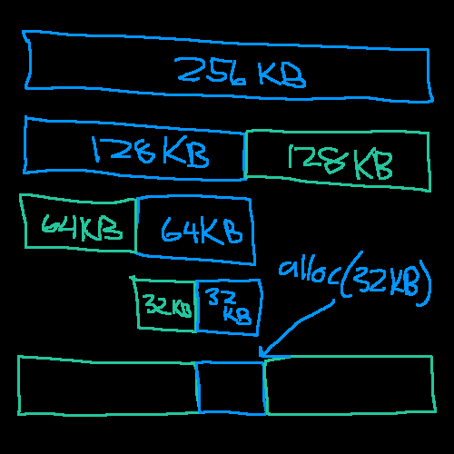

The nice property shows up on the *next* request. Ask for 64 KB and one of the
blocks you already split off is exactly the right size, no more splitting:

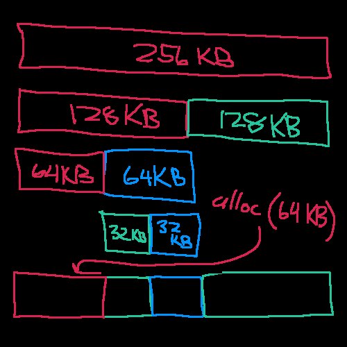

And freeing is where the name earns itself. When you release a block you check
its *buddy*, the adjacent block of the same size at the same level, and if it's
also free you *coalesce* them back into the larger block. Free the 32 KB and it
merges with its free neighbor:

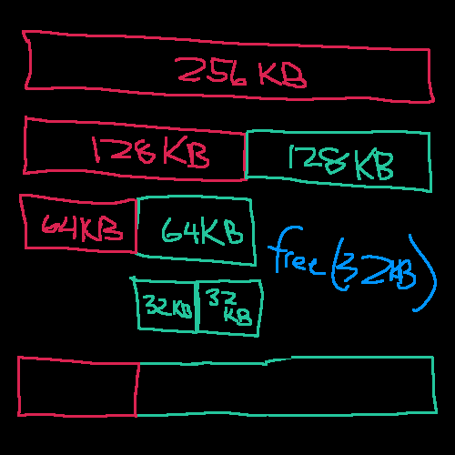

The wrinkle is there are no headers on these blocks, so "where's my buddy and is
it free" isn't answerable from the block itself. You end up needing a side
structure, a bitmap, to track which regions are free at each level. So even
buddy leans on a bitmap underneath. You get logarithmic allocation and clean
coalescing, at the cost of that bookkeeping and the power-of-two rounding that
wastes anything not a clean power of two (you can't ask for 90 KB).

### Slab

Slab takes it one step further in the opposite direction: a slab only ever
allocates *one fixed size*. You create a slab for a specific struct and it hands
out and reclaims objects of exactly that size:

```c
struct slab *slab_create(size_t struct_sz);
slab_alloc(struct slab *s);
slab_free(struct slab *s, void *ptr);
```

Internally it's a free-list, so allocation is a single pointer chase with no
internal fragmentation and no coalescing to do. It's perfect for the kernel
churning through the same object type over and over (think task structs), and in
a real system you'd layer it *on top* of buddy: slab gets slabs from buddy, buddy
gets frames from the physical allocator. It's not general-purpose on its own,
though. Strings and odd sizes don't fit the model.

### Why I went with a bitmap anyway

Both of those are the right long-term answer and both are overkill for a kernel
that is currently 9.2 KB. What I need *right now* is the dumbest correct thing
that lets me stop bootstrapping off a hand-mapped identity region. A bitmap is
one bit per frame, trivially correct, and I can always put buddy or slab on top
of it later when there's a workload that cares. So bitmap it is.

## The Bitmap

One bit per frame. Set means in use, clear means free. The bitmap itself lives at
the very start of the usable region, so it's carved out of the same memory it
tracks:

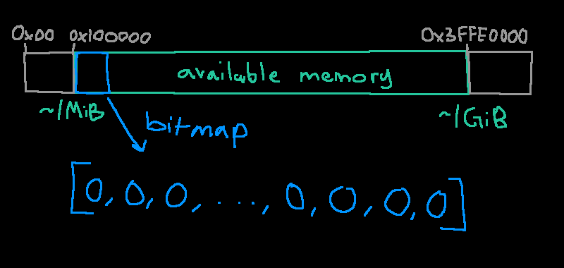

Bit `i` maps to the frame at `region.base + i * 4 KiB`. That's the entire
addressing scheme:

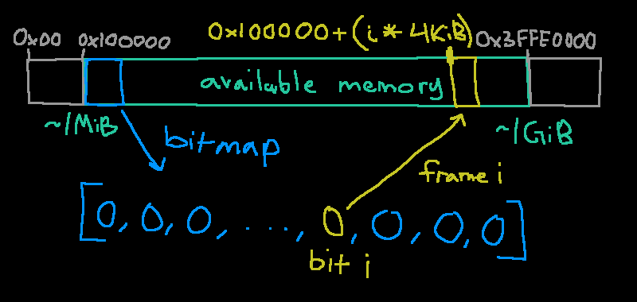

### Sizing it

If there are `N` frames I need `N` bits, so `N/8` bytes, rounded up so a frame
count that isn't a multiple of 8 doesn't get truncated. That's a `+7` before the
divide, hidden in a macro:

```c
#define BITMAP_BYTES(frames) (((frames) + 7) / 8)
```

The word type is aliased so I can widen it later. Today it's a `uint8_t`; if I
ever want faster scans I swap it for a `uint32_t` and the bit math follows the
`sizeof`:

```c
typedef uint8_t bitmap_word_t;
#define BITMAP_BITS (8 * sizeof(bitmap_word_t))
```

The bitmap's byte count comes from `BITMAP_BYTES`, and its footprint in memory is
that rounded up to a whole page, based at the region's base:

```c
struct pm_bitmap {
  struct pm_region region;
  size_t bytes;
  bitmap_word_t *ptr;
  size_t next_hint;
};
```

```c
bmp->bytes = BITMAP_BYTES(avail.frames);
bmp->region.len = PAGE_ALIGN_UP(bmp->bytes);
bmp->region.base = avail.region.base;
bmp->ptr = (bitmap_word_t *)bmp->region.base;
```

Where the page-align macro is the usual round-up-to-4-KB:

```c
#define PAGE_SIZE (0x1000UL)
#define PAGE_ALIGN_UP(x) (((x) + (PAGE_SIZE) - 1) & ~((PAGE_SIZE) - 1))
```

The set/clear/test helpers are internal to the translation unit, so `static`. To
touch bit `i` you index word `i / BITMAP_BITS` and mask bit `i % BITMAP_BITS`:

```c
static void _bitmap_clear(size_t i) {
  avail.bitmap.ptr[i / BITMAP_BITS] &= ~(1U << (i % BITMAP_BITS));
}

static void _bitmap_set(size_t i) {
  avail.bitmap.ptr[i / BITMAP_BITS] |= (1U << (i % BITMAP_BITS));
}

static int _bitmap_test(size_t i) {
  return avail.bitmap.ptr[i / BITMAP_BITS] & (1U << (i % BITMAP_BITS));
}
```

### Marking its own frames used

Initialization is three passes. First clear everything, because I can't assume
this memory is zeroed. Then set the bits for the frames the bitmap itself
occupies, because the allocator must never hand out the pages it's living in:

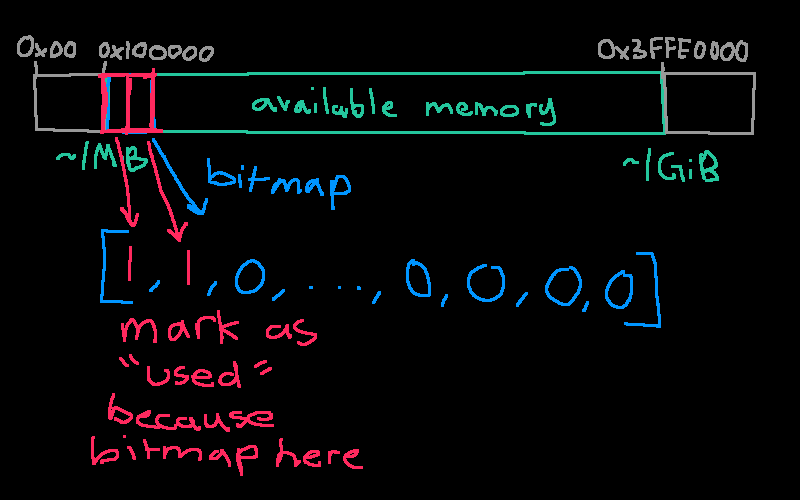

### The excess bits

The bitmap byte count almost never lands exactly on the frame count, so there are
leftover high bits in the last byte that don't correspond to any real frame. If I
leave those clear, the allocator will happily "find" a free frame that doesn't
physically exist. So I set them too:

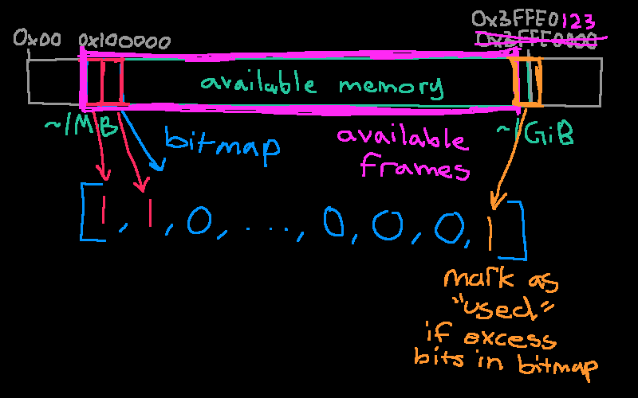

Put together, and folding the bitmap's own frames into a `next_hint` I'll explain
in a second, `pm_init` ends like this:

```c
for (size_t i = 0; i < avail.frames; i++)
  _bitmap_clear(i);
for (size_t i = avail.frames; i < bmp->bytes * BITMAP_BITS; i++)
  _bitmap_set(i);
bmp->next_hint = bmp->region.len / PAGE_SIZE;
for (size_t i = 0; i < bmp->next_hint; i++)
  _bitmap_set(i);
return &avail.region;
```

Dumping the state confirms the math. The bitmap sits at `0x100000`, the first
byte is `0xFF`, and its page-aligned length is `0x8000`, so it spans 8 frames:

```sh
Available memory found:
  base=0x0000000000100000
  len=0x000000003FEE0000
  frames=0x000000000003FEE0
Bitmap:
  bytes=0x0000000000007FDC
  region:
    base=0x0000000000100000
    len=0x0000000000008000
  *ptr=0xFF, ptr=0x0000000000100000
  ptr:
    val=0xFF
    derefed=0x0000000000100000
  data=
    0x00000000000000FF
    0x0000000000000000
    0x0000000000000000
    ...
```

> Sorry the coloring is weird. If I set the language to `txt` the formatting is
> off so just set it to `sh`!

## Alloc and Free

`pm_alloc_frame` returns one frame. Scanning the whole bitmap every call is
`O(n)`, so I keep a `next_hint` and start scanning there, wrapping around the end.
It's a cheap next-fit that avoids rescanning the low frames every time:

```c
uint64_t pm_alloc_frame(void) {
  for (size_t n = 0; n < avail.frames; n++) {
    size_t i = (avail.bitmap.next_hint + n) % avail.frames;
    if (!_bitmap_test(i)) {
      _bitmap_set(i);
      avail.bitmap.next_hint = i + 1;
      uint64_t addr = avail.region.base + i * PAGE_SIZE;
      return addr;
    }
  }
  return PM_NULL_FRAME;
}
```

Free is the inverse, with range checks so a bogus address is a no-op rather than
memory corruption:

```c
void pm_free_frame(uint64_t phys_addr) {
  if (phys_addr < avail.region.base)
    return;
  size_t i = (phys_addr - avail.region.base) / PAGE_SIZE;
  if (i >= avail.frames)
    return;
  if (_bitmap_test(i)) {
    _zero_frame(phys_addr);
    _bitmap_clear(i);
  }
}
```

I zero the frame on free, so a page later handed to userspace doesn't arrive
full of leftover kernel data someone could read. There's no `memset` yet, so it's
a hand-rolled 64-bit-at-a-time loop:

```c
static void _zero_frame(uintptr_t pa) {
  for (size_t i = 0; i < PAGE_SIZE / sizeof(uintptr_t); i++)
    ((uintptr_t *)vm_ptov(pa))[i] = 0;
}
```

> That `vm_ptov` is a forward reference. Once the real page tables are up, the
> bitmap and every frame get reached through a *physmap* window instead of by
> raw physical address. I'll get there. For now just note that `_zero_frame`
> already goes through it.

A quick test, alloc then free, watched in GDB:

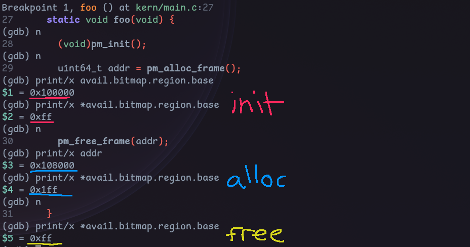

At init the bitmap's first byte is `0xFF`, the 8 frames it occupies. The first
allocation returns `0x108000`, the ninth frame, right after the bitmap, and the
byte becomes `0x1FF`. Freeing it drops back to `0xFF`. The allocator works. So
now I have a source of physical frames, which means I can finally build page
tables that aren't a hardcoded identity map!

## Going Higher Half

A higher-half kernel has been the goal since I first started thinking about
virtual memory[^7]. The idea: the kernel lives at the top of every address
space, the same virtual range in every process, and the bottom is left for user
code. When I add per-process address spaces later, every process shares the
kernel's upper mappings, so a syscall or interrupt doesn't need a `CR3` switch.

### Why negative 2 GB

The specific address falls out of a compiler flag, not a preference. GCC's
`-mcmodel=kernel` [^8] says the kernel "runs in the negative 2 GB of the address
space." Decode that literally: the max 64-bit virtual address is
`0xFFFF_FFFF_FFFF_FFFF`, subtract 2 GB (`0x8000_0000`) and add 1, and you land
on `0xFFFF_FFFF_8000_0000`.

```py
0xFFFF_FFFF_FFFF_FFFF - 0x8000_0000 + 1 = 0xFFFF_FFFF_8000_0000
```

That's my `KERN_VMA`. The kernel model tells GCC every symbol lives in the top 2
GB, so it emits 32-bit sign-extended displacements to reach them. Put the kernel
anywhere else in the high half and those relocations can't reach, and you get the
`relocation truncated to fit` error from the other direction. The number isn't a
design choice, it's two's complement.

### Canonical addresses do the bounds checking for you

x86-64 doesn't actually use all 64 bits for addressing; it uses 48 (before
5-level paging). Bits 63:48 must be a sign-extension of bit 47, or the address is
*non-canonical* and touching it faults with `#GP`. That carves the space into
three:

```py
0x0000000000000000 - 0x00007FFFFFFFFFFF  # bit 47 = 0, upper bits 0 (low half)
0x0000800000000000 - 0xFFFF7FFFFFFFFFFF  # NON-CANONICAL, GP on use
0xFFFF800000000000 - 0xFFFFFFFFFFFFFFFF  # bit 47 = 1, upper bits 1 (high half)
```

The PML4 index is bits 47:39. Index 256 is `0b100000000`, i.e. bit 47 set, so
*every* high-half address lands in `PML4[256..511]` and every low-half address in
`PML4[0..255]`. The user/kernel split is exactly the canonical boundary,
expressed as table indices. That's the elegance: it's literally impossible for a
non-kernel pointer to carry a leading `0xFFFF`.

And you get free debugging out of it. Glance at any address:

- `0xFFFF...` is kernel
- `0x0000...` is user
- anything else is a corrupt pointer

That third case is the underrated one. A garbage value is overwhelmingly likely
to be non-canonical, so it faults *immediately* instead of silently reading
something.

> My kernel has to fit in that 2 GB window, which, no worries, I'm not writing a
> 2 GB kernel.

### The linker script split

The problem: I start executing at low physical addresses because that's mandatory
when jumping up through real, protected, and long mode. You can't load a 64-bit
virtual address into anything until you're already in long mode with paging on.
So a slice of code has to run at its physical address while the rest is linked
high.

The linker script solves this cleanly. `.text.boot` stays at its load address
(`0x8000`), and everything after it is linked at `KERN_VMA + LMA`, with `AT()`
telling the linker the physical load address is still low:

```c
ENTRY(_start)
SECTIONS {
  . = KERN_OFFSET;

  /* Runs in 32-bit pmode before paging reaches the higher half, so VMA == LMA
   * here. This is the only code linked at a physical address. */
  .text.boot ALIGN(0x1000) : {
    *(.text.boot)
    . = ALIGN(0x1000);
  }

  __kern_lma = .;
  . = KERN_VMA + __kern_lma;

  .text ALIGN(0x1000) : AT(ADDR(.text) - KERN_VMA) {
    __text_start = .;
    *(.text*)
    . = ALIGN(0x1000);
    __text_end = .;
  }
  /* .rodata, .data, .bss follow the same AT(ADDR - KERN_VMA) pattern */
```

To reach the high-linked code I add a second mapping in the boot assembly:
`PML4[511]` points at a high PDPT, whose entry 510 points at the *same* page
directory the identity map uses. Both `PML4_IDX(KERN_VMA)` and
`PDP_IDX(KERN_VMA)` are computed from the config value so the indices can't drift:

```asm
    ;; PML4[511] -> PDPT_HI
    mov   edi, PML4T_PMA + PML4_IDX(KERN_VMA) * PTTE_SIZE
    mov   dword [edi], PDPT_HI_PMA | PTTE_P | PTTE_RW

    ;; PDPT_HI[510] -> PDT
    mov   edi, PDPT_HI_PMA + PDP_IDX(KERN_VMA) * PTTE_SIZE
    mov   dword [edi], PDT_PMA | PTTE_P | PTTE_RW
```

Both halves now point at the same page directory, so physical `0x0`-`0x40000000`
is visible at both `0x0` and `0xFFFFFFFF80000000`. That's what lets the far jump
into the high-half kernel land somewhere real. To get there I trampoline through
a register, because you can't directly `jmp` to a full 64-bit immediate:

```asm
    jmp   KERN_CODE_SEL:_trampoline

[bits 64]
_trampoline:
    mov   rax, _start64
    jmp   rax
```

## Building the Real Page Tables

The boot-time tables were a means to an end: get into long mode with *something*
mapped. Now that I have a physical allocator, I throw them away and build proper
4 KB tables from allocated frames.

### 4 KB instead of 2 MB

The 2 MB identity map was fine for bootstrapping but wrong for a real kernel. With
2 MB pages the entire kernel shares one giant page, which means `.text` is
writable because the stack lives in the same page. That's the opposite of what I
want. 4 KB pages let me give each section its true permissions, and they add the
fourth level of table (the PT) that all the documentation actually talks about.
On the CPU side it's just clearing the `PS` bit in the PDE[^9].

### The physmap trick

Here's the problem building tables in the high half: to install an entry I need to
*write* to a page table, but a page table is addressed by its *physical* frame,
and once I drop the identity map I have no virtual address for arbitrary physical
memory. The standard fix is a *physmap*: map all of physical RAM once at a fixed
high base (`PHYSMAP_BASE`), so physical address `pa` is always reachable at
`pa + PHYSMAP_BASE`. Two tiny inlines capture the whole convention:

```c
static inline void *vm_ptov(uint64_t addr) {
  return (void *)(addr + PHYSMAP_BASE);
}

static inline uint64_t vm_vtop(void *addr) {
  return (uint64_t)addr - PHYSMAP_BASE;
}
```

The top-level `pml4` is a static, page-aligned array in `.bss`, so it has a real
symbol I can point `CR3` at. Every lower table is a fresh physical frame from
`pm_alloc_frame`, reached for writing through `table_base` (which is
`PHYSMAP_BASE` once the physmap exists):

```c
static uintptr_t pml4[PTT_ENTS] __attribute__((aligned(PAGE_SIZE)));
static uintptr_t table_base = 0;

static uintptr_t *_table_ptr(uintptr_t pa) {
  return (uintptr_t *)(pa + table_base);
}

static uintptr_t _alloc_table(uintptr_t *ptte, uint64_t flags) {
  if (!ptte || *ptte & PTTE_P)
    return 0;
  uintptr_t pa = pm_alloc_frame();
  if (pa == PM_NULL_FRAME)
    return 0;
  *ptte = (pa & 0x000FFFFFFFFFF000UL) | PTTE_P | flags;
  return pa;
}
```

`vm_map` walks the four levels, allocating any missing intermediate table, and
writes the leaf. The index macros just slice the virtual address into its 9-bit
fields:

```c
#define PML4_IDX(va) (((va) >> 39) & 0x1FF)
#define PDP_IDX(va)  (((va) >> 30) & 0x1FF)
#define PD_IDX(va)   (((va) >> 21) & 0x1FF)
#define PT_IDX(va)   (((va) >> 12) & 0x1FF)
```

```c
int vm_map(uintptr_t va, uintptr_t pa, uint64_t flags) {
  uintptr_t *pml4e = &pml4[PML4_IDX(va)];
  if (!(*pml4e & PTTE_P) && !_alloc_table(pml4e, flags))
    return -1;

  uintptr_t *pdpe = &(_table_ptr(PTTE_ADDR(*pml4e)))[PDP_IDX(va)];
  if (!(*pdpe & PTTE_P) && !_alloc_table(pdpe, flags))
    return -1;

  uintptr_t *pde = &(_table_ptr(PTTE_ADDR(*pdpe)))[PD_IDX(va)];
  if (!(*pde & PTTE_P) && !_alloc_table(pde, flags))
    return -1;

  uintptr_t *pte = &(_table_ptr(PTTE_ADDR(*pde)))[PT_IDX(va)];
  if (!(*pte & PTTE_P))
    *pte = PTTE_ADDR(pa) | flags | PTTE_P;
  return 0;
}
```

> There's a real footgun here: if an intermediate table already exists,
> `_alloc_table` bails and the new mapping's `flags` never reach that level.
> Passing leaf flags down to the table entries was only ever for the user
> mapping, and it means the caller has to know about intermediate tables, which
> is TERRIBLE.

### Mapping the kernel with real permissions

`vm_init` lays down the physmap first (NX and writable, because it's data not
code), then each kernel section with the permissions it should actually have,
then swings `CR3` over to the new `pml4`. The section boundaries come straight
from the linker symbols:

```c
int vm_init(uintptr_t physmap_pa, size_t physmap_len) {
  if (vm_map_range(PHYSMAP_BASE, physmap_pa, physmap_len, PTTE_NX | PTTE_RW) < 0)
    return -1;
  if (vm_map_range((uintptr_t)__text_start, _kern_v2p(__text_start),
                   _seclen(__text_start, __text_end), 0) < 0)
    return -1;
  if (vm_map_range((uintptr_t)__rodata_start, _kern_v2p(__rodata_start),
                   _seclen(__rodata_start, __rodata_end), PTTE_NX) < 0)
    return -1;
  if (vm_map_range((uintptr_t)__data_start, _kern_v2p(__data_start),
                   _seclen(__data_start, __bss_end), PTTE_RW | PTTE_NX) < 0)
    return -1;

  table_base = PHYSMAP_BASE;
  _load_cr3(_kern_v2p((char *)pml4));
  return 0;
}
```

So the sections finally get honest bits:

- `.text` executable, read-only (flags `0`, so present + read + execute)
- `.rodata` read-only, NX
- `.data` and `.bss` read-write, NX

I enabled `NXE` back in the boot assembly (the `0x900` into `EFER` sets LME and
NXE together) so the NX bit is actually respected.

To sanity-check that the higher-half linking really lines up with what's on disk,
I opened the kernel ELF and the disk image side by side in Cutter:

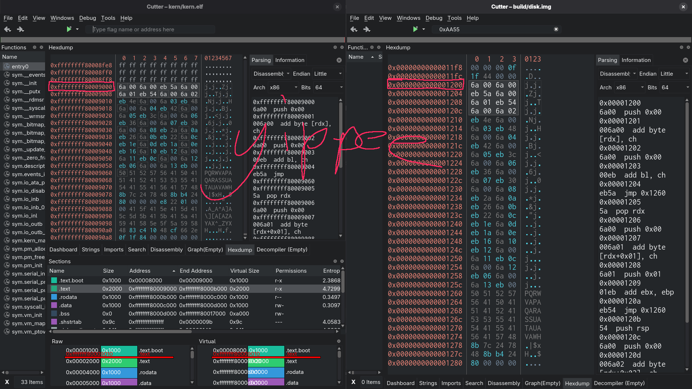

The `.text` section is linked at virtual `0xFFFFFFFF80009000` but its bytes sit at
physical `0x9000`, which on disk is offset `0x1200` (the kernel starts at sector
1, `0x200`, and `.text` is one page into it). Same bytes in both panes. The
sections pane shows the permissions landing exactly as intended: `r-x` for
`.text`, `r--` for `.rodata`, `rw-` for `.data` and `.bss`.

### The bitmap pointer has to move

One consequence of the physmap that bit me and is worth calling out. During
`pm_init`, the identity map is still live, so the bitmap pointer is a raw physical
address (`0x100000`) and dereferencing it just works. But `vm_init` drops the
identity map. After that, `0x100000` is no longer mapped, and the bitmap has to be
reached through the physmap like everything else. So there's an explicit fixup
that runs right after `vm_init`:

```c
/* FIXME: Refactor. This function is weird and a footgun */
void pm_update_ptr(void) { avail.bitmap.ptr += PHYSMAP_BASE; }
```

And the init sequence in `kern_main` is ordered around exactly that dependency:
build the map, hand its length to the VMM, *then* relocate the bitmap pointer:

```c
const struct pm_region *physmap = pm_init();
if (!physmap)
  return;
if (vm_init(0, physmap->len) < 0)
  return;
pm_update_ptr(); // FIXME: See fn definition
```

It's tagged `FIXME` because a function that silently adds a constant to a
pointer is exactly the kind of thing that fucks me over in six months when I
forget it exists.

## Entering User Mode

With real page tables I can finally map a user program properly instead of poking
a U/S bit into a 2 MB identity page. `__enter_user_mode` maps a fresh
user-accessible range at virtual address `0`, reads the program in off disk, and
`iretq`s down to ring 3 with the stack one page up:

```c
static int __enter_user_mode(void) {
  const uintptr_t va = 0;

  // FIXME: The flags => executable AND read/write. Need I say more?
  if (vm_map_range(va, USER_OFFSET,
                   PAGE_ALIGN_UP(USER_SECTORS * DISK_BLOCK_SIZE),
                   PTTE_RW | PTTE_US) < 0)
    return -1;
  io_ata_pio_read(USER_LBA, USER_SECTORS, (uint32_t *)va);

  asm("movq %0, %%rax\n\t"
      "movw %%ax, %%ds\n\t"
      /* ... load the other data segments ... */
      "pushq %0\n\t"     // SS  = user data selector
      "pushq %1\n\t"     // RSP = va + PAGE_SIZE
      "pushq $0x202\n\t" // RFLAGS with IF set
      "pushq %2\n\t"     // CS  = user code selector
      "pushq %3\n\t"     // RIP = va
      "iretq"
      :
      : "r"((uint64_t)GDT_USER_DATA_SEL), "r"((uint64_t)(va + PAGE_SIZE)),
        "r"((uint64_t)GDT_USER_CODE_SEL), "r"((uint64_t)va)
      : "rax", "memory");

  return 0;
}
```

It works, and it's already better than the old scheme, which read the program
into a fixed offset *before paging was even up*. But look at the flag on that
mapping: `PTTE_RW | PTTE_US`, no NX. The user page is writable *and*
executable... which I'll fix later, I just wanna get this blog post out.

## Where This Leaves Me

I set out to replace the memory management vibes with something real, and that's
done: a physical allocator backed by the E820 map, a genuine higher-half address
space, 4 KB page tables built from allocated frames with per-section permissions,
and a physmap so I can actually manipulate those tables. The kernel no longer
runs on an identity map and a prayer.

The next OS dev post will either be the shell, so I can actually run things in
userspace against the syscall API I already have, or networking (probably the
shell).

## References

[^1]: [Memory Map (x86), Real mode address space - OSDev
    Wiki](https://wiki.osdev.org/Memory_Map_(x86)#Real_mode_address_space_(%3C_1_MiB))
[^2]: [Detecting Memory (x86), INT 0x15 EAX=0xE820 - OSDev
    Wiki](https://wiki.osdev.org/Detecting_Memory_(x86)#BIOS_Function:_INT_0x15,_EAX_=_0xE820)
[^3]: [My own tweet whining about this exact
    chicken-and-egg](https://x.com/wasdhjklxyz/status/2086322304640778573)
[^4]: [Memory Map (x86), Extended Memory (> 1 MiB) - OSDev
    Wiki](https://wiki.osdev.org/Memory_Map_(x86)#Extended_Memory_(%3E_1_MiB))
[^5]: [Page Frame Allocation, Physical Memory Allocators - OSDev
    Wiki](https://wiki.osdev.org/Page_Frame_Allocation#Physical_Memory_Allocators)
[^6]: [GWU OS: Memory Allocation - Slab and Buddy Allocators, Gabriel
    Parmer](https://www.youtube.com/watch?v=DRAHRJEAEso)
[^7]: [Higher Half Kernel - OSDev
    Wiki](https://osdev.wiki/wiki/Higher_Half_Kernel)
[^8]: [x86 Options, -mcmodel=kernel -
    GCC](https://gcc.gnu.org/onlinedocs/gcc/x86-Options.html#index-mcmodel_003dkernel)
[^9]: [Hard-copy AMD64 Architecture Programmer's Manual, vol 2 (System
    Programming), rev 3.07, on the PDE PS bit (pp ~161) and 4 KB page
translation (pp ~226-227)](#)
