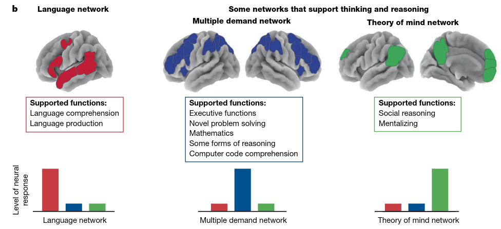
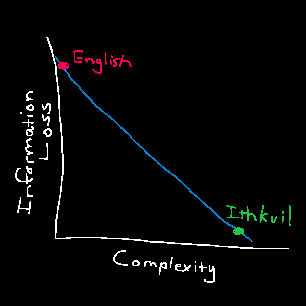
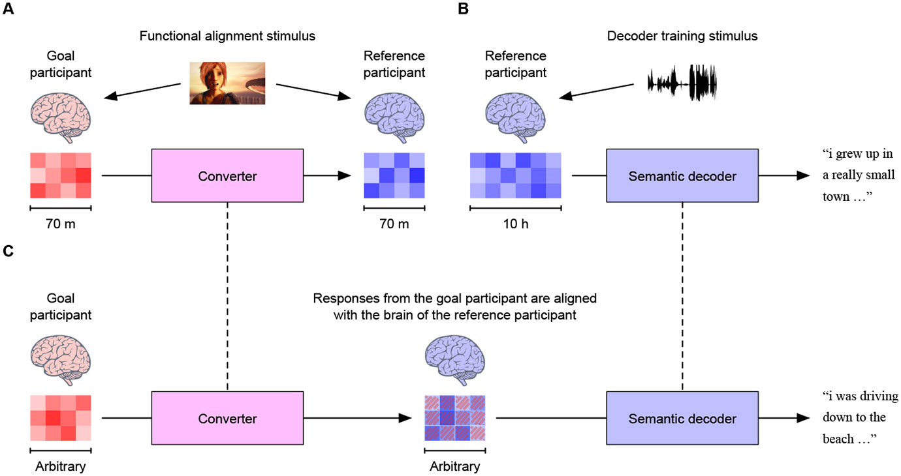

# Why You Can't Just Download a Thought
<time datetime="2026-07-29">Jul, 29 2026</time>

## Intro

My thoughts outrun my mouth. Not in a fun way. In a "I have a complete model of
the thing in my head and the pipe out of my skull runs at maybe 150 words a
minute" way. Every time I try to explain something I actually care about, I
watch it get flattened on the way out, then watch the person on the other end
reconstruct something only somewhat adjacent to it and nod.

Going in, I had a clean theory about why: **language is a lossy compression of
thought, so build a better one.** But this is wrong, in a way that took me a
while to see, and the specific shape of the wrongness turned out to be more
interesting than the original complaint.

The thing that kicked this off is Fedorenko, Piantadosi & Gibson's *Language is
primarily a tool for communication rather than thought*[^1]. The claim: the
brain's language network is required to comprehend and produce language, and is
not required to reason. Two lines of evidence, and they're worth stating because
the headline sounds like philosophy and it isn't.

First, people with global aphasia, whose language network is wrecked, can still
do arithmetic, play chess, follow causal chains, and pass theory-of-mind tasks.
Second, fMRI shows the language network sitting quiet during math, formal logic,
and even reading source code. Language is how thought gets in and out. It is not
the thinking itself.

The thesis of this post:

> Language isn't a lossy compression of thought. It's a way of causing a
> related-enough idea to happen inside a head that was built differently from
> yours, and the vagueness is what makes that possible at all. My actual problem
> was never precision. It's rate.

Everything below is me getting from the first sentence to the second.

## 350 years of trying to fix language

Leibniz wanted a *characteristica universalis*, a symbol system where every
concept decomposes into primitives, paired with a *calculus ratiocinator*, a
mechanical procedure for reasoning over it[^2]. The pitch is one of the best
lines in the history of philosophy: two philosophers in a dispute would stop
arguing, pick up their pens, and say *calculemus*. Let us calculate.
Disagreements become arithmetic, errors become visible at a glance.

Every serious attempt since has run the same trajectory:

- Frege built the *Begriffsschrift*[^3], which is real and load-bearing and
became modern formal logic. It also does not let you say "I miss my dog"
- Wittgenstein wrote the *Tractatus*[^4], claiming propositions are logical
pictures of facts, then spent the rest of his career personally demolishing it
- Carnap tried to reconstruct all of experience from logical primitives in the
*Aufbau*[^5] and it didn't hold
- Loglan[^6] and Lojban[^7] got built, got communities, and did not get native
speakers who think in them

Notice what actually happened. Formal logic **worked**, and it's one of the best
things we have. What didn't work is the part where it swallows meaning. Frege
got the calculus and not the characteristic. Every project on this list built
something useful and then failed, which is a strong hint that the failure is
structural rather than a series of unlucky attempts.

## The Whorf detour, and why it's a dead end

Before the actual argument, the objection everyone raises here, because if I
don't address it a linguist will and they'll be right to.

**Linguistic relativity**, the Sapir-Whorf hypothesis[^8], comes in two
strengths. Strong: language determines thought, you cannot think what your
language can't express. Weak: language nudges thought, habitual categories make
some distinctions cheaper to notice.

Strong Whorf is dead. It's been dead for decades. The evidence against it is
partly the same evidence from the Fedorenko paper: aphasics who lost language
and kept reasoning are a direct refutation of "no language, no thought." Weak
Whorf survives, with real effects in color discrimination and spatial reasoning,
and those effects are small and task-specific.

This matters because **"build a better language and you'll think better" is
strong Whorf wearing an engineering hat.** If I'd noticed that earlier I'd have
saved myself a section. The whole conlang-as-cognitive-upgrade pitch inherits a
hypothesis the field abandoned. Keep it in your pocket, it's about to explain
Ithkuil.

## No two brains were built to the same spec

Here's the reframe that made it click, and it comes from my own code, so give me
one paragraph of programming and then I'll drop it.

I wrote a library called libpak[^9] that packs data into a compact binary
message so one machine can hand it to another. It works for exactly one reason:
both machines were built from the same description of what that message looks
like. Same fields, same order, same sizes. Without the shared description the
message isn't degraded, it's meaningless. The receiver gets a run of bytes and
has no way to know which byte was which.

Now the point, and this is the whole post. **Two brains have no shared
description.** Every brain assembles its own private version of every concept
out of its developmental history, its sensory quirks, and whatever happened to
it at an early age. "Grief" in your head and "grief" in mine are not the same
thing stored slightly differently. They are different things that happen to have
the same name.

So a word is not a container that meaning travels inside. A word is a **label**,
and the thing hanging off that label is different in every person you say it to.
You say *grief*, and the other person doesn't receive your version. They go look
up theirs and run that. This is why poetry works and why arguments don't.

> For the programmers, the compressed version: the word is the header file, the
> meaning is the implementation, and everyone links against a different `.so`.
> That's the whole thing, and it's where the original title of this post came
> from. I'm going to stop talking like that now, because the argument doesn't
> need it.

Which flips the ambiguity complaint on its head... Language is vague **because
it has to be.** Any system for getting an idea from one head into a differently
built head is going to be approximate, because there is nothing shared to be
exact *about*. Strip the vagueness out and you get something that transmits
perfectly to exactly one person, which is just... having a thought.

I want to be clear that **I did not invent this.** Piantadosi, Tily & Gibson
made the formal version of the argument in 2012[^10]: any efficient
communication system will be ambiguous, given that context carries information
about meaning. If the listener can figure out what you meant from context for
free, then spelling it out is wasted effort. Ambiguity isn't a defect the system
failed to remove, it's how the system stays cheap.

There's a Pareto frontier here[^11] and natural language sits on it. The
tradeoff is complexity (how expensive the language is to learn and hold in your
head) against informativeness (how precisely its words pin down what you meant).
You can move along the curve. You cannot get both for free. And this goes all
the way down into grammar: in real languages, words that depend on each other
sit measurably closer together than chance would predict, across 37
languages[^12], because holding a sentence open while you wait for the other
half is expensive.

"Alfred gave Batman a briefing." Who's Alfred, what's he wearing, was it in
person or over comms, briefing on what. Every word drops context you have to
reconstruct. And it works fine, because you already know who Alfred is. The
sentence isn't transmitting the scene, it's **naming a scene you can already
build.** Same reason "can you put the thing away" works. Shared context isn't a
crutch language leans on, it's the ground language stands on.

## Ithkuil is the control experiment

If the theory is "our language is too vague, build a sharper one," Ithkuil is
the strongest version of that attempt anyone has actually shipped. It's
explicitly designed for depth, precision, and conciseness, using a matrix of
grammatical categories meant to make explicit what natural languages leave
implicit[^13][^14].

And it is unusable. Not according to me, according to its own author, who says
the only part he's fluent in is the morphology and that he still looks up rules
when writing[^15]. That's the whole result. **You can build the more complete
language. You cannot pay the cost of learning it.** Which is exactly what the
Pareto framing predicts: he didn't beat the frontier, he moved along it, buying
precision with complexity until the complexity ate the thing.

David Peterson makes the complementary point in the Conlang Manifesto[^16]:
judged on utility, language creation is pointless, and the real case for it is
art. Which lands uncomfortably well here. Poetry and literature aren't
decoration bolted onto a communication system. They're what you do **because**
the system is approximate. You're not transmitting a meaning, you're building a
stimulus that makes the other person's own version of things produce something
close to yours. A metaphor is a set of words picked so that whatever they
already have in their head lands near whatever you have in yours.

> The strongest counterexample to the whole "you can't beat the frontier" claim
> is notation. Arabic numerals vs Roman numerals is a real representational
> upgrade that made previously-hard thinking easy, and so is musical notation,
> and so is Feynman diagrams! Why do those work when Ithkuil doesn't? Could it
> be that they are domain-specific and small? They don't try to cover all of
> meaning like Ithkuil!

## What I actually want is a rate problem

Here's the thing I had wrong for most of the time I was writing this.

In principle, two people with unlimited patience **can** converge. You go layer
by layer, you check understanding, you build the shared context up from nothing.
This is what teaching is. It demonstrably works. It's just brutally slow (in my
experience), and both parties have to want it (which makes a beautiful
conversation).

So my complaint was never "language is too vague to hold my thought." The
complaint is "I can get `n` words a minute out of my mouth and I have a
dissertation in my head." That's a **rate** problem, not a **precision**
problem. And that distinction decides which technologies are even relevant.

## Which brings me to BCIs

A brain-computer interface is a faster wire. It doesn't do anything about the
fact that the two ends were built differently. So "download the thought and
improve on it instantly" is the same category error as Ithkuil, one layer down.
Worth knowing what's actually real, roughly in order of how well it works.

### Motor decoding

Solid, unglamorous, real since BrainGate in the 2000s[^17].
Cursor control, robotic arms. It's tractable because the signal is close to the
output: you're reading an intended movement off motor cortex, and an intended
movement is already almost a command.

### Speech neuroprostheses

Also real, and the detail that matters is *what* they decode. They read the
articulatory motor plan, the muscle commands you'd have sent to your vocal
tract. That's downstream of everything interesting. It's a keyboard made of
neurons. Meta's Brain2Qwerty[^18] does a non-invasive version for typing, which
is impressive engineering but requires you to sit inside a magnetically shielded
MEG room.

### Semantic decoding

Tang and Huth's fMRI decoder[^19] is the interesting one, and the first thing
here that isn't just reading motor commands. It reconstructs continuous language
from the brain's representation of *meaning*, gist-level rather than
word-for-word, using a language model as a prior over what you plausibly meant.
Two details from that work matter more than the headline: it took roughly 16
hours of training data *per person*, and a decoder trained on one person did not
work on anyone else. Train on me, run on you, get nothing.

That second result is my entire argument showing up as an experimental finding.
Each brain encodes meaning in its own private way, and a reader built for one
brain is useless pointed at another. I'd have stopped there and called it a day.
Except they kept going.

### The 2025 follow-up is the actual punchline

Tang and Huth got cross-participant decoding working[^20]. The method: record
both brains responding to the same stimuli, including silent movies with no
language in them at all, learn the mapping between the two, then run the first
person's decoder on the second.

Read that again, because it isn't a refutation of the problem, it's a
confirmation with a receipt. Cross-brain decoding became possible **only** by
sitting two people in front of the same things and learning how each one's
private encoding lines up with the other's. They didn't skip the shared
groundwork. They built it. Which is, notice, language acquisition, automated.
You still pay the cost. You just pay it in scanner hours instead of in
childhood.

### Writing into a brain

Barely a thing. Stimulation gets you crude tactile sensation and phosphenes,
dots of light. There is no known operation for "insert proposition," and it
isn't obvious what that would even mean, since the thought would have to arrive
already expressed in whatever private form that particular brain uses. Which is
the same wall as before, approached from the other side.

> One correction to a thing I believed going in. I started with the
> Broca's-does-production / Wernicke's-does-comprehension model, which is a
> caricature. Lesion-symptom mapping[^21] and the modern language network work
> both make the localization far messier than the textbook picture. Don't build
> your mental model of BCI targets on a diagram from 1874!

## So what does this actually get me

A mature speech prosthesis that beats spoken word rate is plausible on a normal
engineering timeline. It attacks the exact bottleneck I have. It buys me a
faster mouth.

It does not buy mutual understanding, and I think I finally see why that isn't a
temporary limitation waiting on electrode count. Consider that with a large
language model we have **total** access: every number inside it, the ability to
freeze it, rerun the same input, delete pieces and watch what breaks, and a full
record of what it was trained on. And "what does this part of the model actually
mean" is still an open research field. That's the easy version of the problem...
the brain version has 86 billion neurons, recordings too noisy to reliably tell
which cell fired, no way to rerun yesterday, and no answer key.

And if a faster mouth is all it is, the receiver becomes the bottleneck
instantly. There's no point emitting at 500 words a minute into someone parsing
at 150. You'd need the comprehension side too, and now you're back to lining up
two different heads, and the only known way to do that is to point them at the
same things for a long time. Which is just... knowing each other for a long
time.

The honest first step isn't neural at all. It's a translator that works *on top
of* language rather than replacing it: something that knows a specific listener
well enough to re-say your idea in the words, structure, and examples that
particular person already has. Not a better language. A rewrite of the one we
have, per listener. Which, if you want to be depressing about it, is what good
teachers and good writers have always done by hand.

## Conclusion

### The build-a-better-language branch has been dead for 350 years

Leibniz, Frege, Carnap, Lojban, Ithkuil. Every attempt to build a language that
can't be misunderstood either narrows into formal logic, which works and can't
carry meaning, or buys precision with learning cost until nobody can learn it.
That isn't bad luck, it's the shape of the problem.

### Ambiguity is load-bearing

Any efficient communication system will be ambiguous, because context is
informative and spelling out what context already supplies is wasted effort.
Natural language sits on the Pareto frontier. It is not a bad system, it's a
system solving a harder problem than I gave it credit for.

### My problem was rate, not precision

Given unlimited time, two people can converge on anything. That's what teaching
is. The failure mode I actually hit isn't "English can't express this," it's
"building the shared context is slow and I get impatient." Different problem,
different fix.

### A BCI is a faster wire, not shared understanding

It genuinely attacks the rate problem, which is my problem, which is why I still
find them interesting. It does not get you understanding. The one result that
moved toward cross-brain decoding got there by building shared ground between
two people first, which is language acquisition with better instruments.

### The practical takeaway

When I can't explain something, the failure is almost never that English is too
lossy. It's that I haven't built enough shared context yet. That's fixable, the
fix is boring, and it doesn't require drilling a hole in anyone!

## References

[^1]: [Fedorenko, Piantadosi & Gibson, "Language is primarily a tool for communication rather than thought," Nature 630 (2024)](https://www.nature.com/articles/s41586-024-07522-w)
[^2]: [The genius who attempted to unify all knowledge (@0I00I00I)](https://www.youtube.com/watch?v=wNlEQnFhANU)
[^3]: [Gottlob Frege, Begriffsschrift (1879), English translation](https://dn720006.ca.archive.org/0/items/gottlob-frege-begriffsschrift-english/Gottlob%20Frege%20-%20Begriffsschrift%20%28English%29_text.pdf)
[^4]: [Ludwig Wittgenstein, Tractatus Logico-Philosophicus (1922)](https://www.gutenberg.org/files/5740/5740-pdf.pdf)
[^5]: [Rudolf Carnap, The Logical Structure of the World, trans. Rolf A. George (1967)](https://www.phil.cmu.edu/projects/carnap/editorial/latex_pdf/1928-1e%20part1.pdf)
[^6]: [Loglan, James Cooke Brown, late 1950s](https://loglan.org/)
[^7]: [John Woldemar Cowan, The Complete Lojban Language](https://lojban.org/publications/cll/cll_v1.1_xhtml-no-chunks/)
[^8]: [The Sapir-Whorf Hypothesis](https://cgdoc.s3.amazonaws.com/Sapir_Whorf.pdf)
[^9]: [wasdhjklxyz/libpak](https://github.com/wasdhjklxyz/libpak)
[^10]: [Piantadosi, Tily & Gibson, "The communicative function of ambiguity in language," Cognition 122(3) (2012)](https://colala.berkeley.edu/papers/piantadosi2012communicative.pdf)
[^11]: [Wikipedia, Pareto front](https://en.wikipedia.org/wiki/Pareto_front)
[^12]: [Futrell, Mahowald & Gibson, "Large-scale evidence of dependency length minimization in 37 languages," PNAS 112(33) (2015)](https://www.pnas.org/doi/10.1073/pnas.1502134112)
[^13]: [Ithkuil, Introduction](https://www.ithkuil.net/00_intro.html)
[^14]: [What People Get Wrong About Language - The Ithkuil Fallacy](https://www.youtube.com/watch?v=3B_uGsgXKdk)
[^15]: [Ithkuil FAQs](https://ithkuil.net/faqs.html)
[^16]: [David J. Peterson, The Conlang Manifesto](https://dedalvs.com/notes/manifesto.php)
[^17]: [BrainGate, Turning Thought Into Action](https://www.braingate.org/)
[^18]: [Meta AI, Brain2Qwerty](https://ai.meta.com/blog/brain2qwerty-brain-ai-human-communication/)
[^19]: [Tang, LeBel, Jain & Huth, "Semantic reconstruction of continuous language from non-invasive brain recordings," Nature Neuroscience 26 (2023)](https://www.nature.com/articles/s41593-023-01304-9)
[^20]: [Tang & Huth, "Semantic language decoding across participants and stimulus modalities," Current Biology 35(5) (2025)](https://pubmed.ncbi.nlm.nih.gov/39919742/)
[^21]: [Bates et al., "Voxel-based lesion-symptom mapping," Nature Neuroscience 6 (2003)](https://langneurosci.org/papers/bates03natneurosci.pdf)
